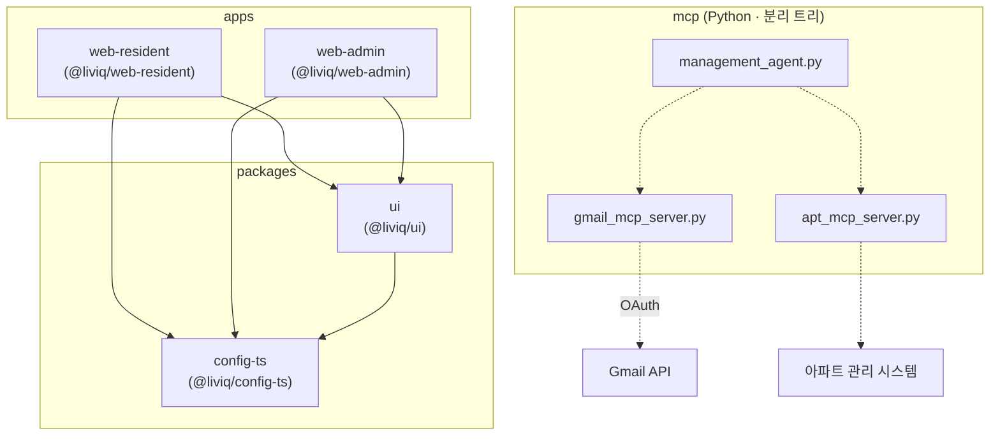
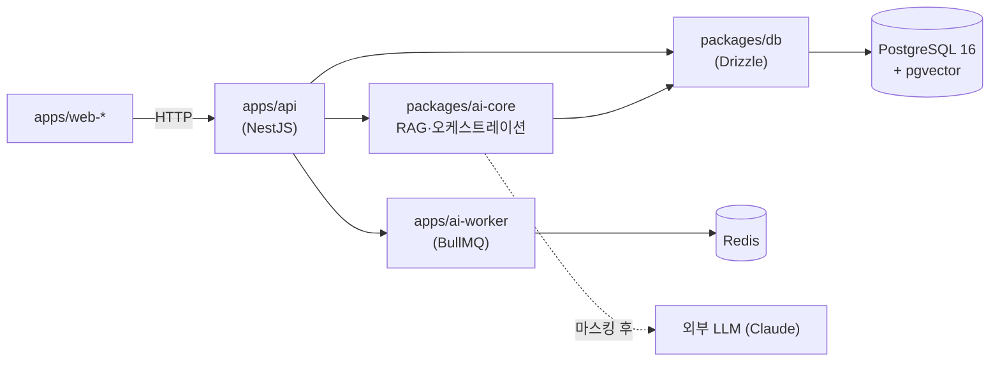

# ARCHITECTURE

LIVIQ 모노레포의 모듈 구성과 의존 관계. 상세 시스템 설계는
[docs/01-architecture.md](docs/01-architecture.md), 디렉토리 규약은
[docs/02-directory-structure.md](docs/02-directory-structure.md) 참고.

이 문서는 **cross-module 의존성**을 한눈에 보여 변경 영향(ripple)을 추적하기 위한 것이다.

## 현재 모듈 의존 그래프

실선 = 실제 코드 의존, 점선 = 런타임/외부 연동.

## 목표 아키텍처 (계획 · 아직 미존재)

계획 컴포넌트를 도입할 때 위 그래프를 **현재 그래프로 승격**하고 이 표를 갱신한다.

## Cross-Module 의존성 표

| 모듈 | 의존 대상 | 종류 | 변경 시 영향 |
|------|-----------|------|--------------|
| `apps/web-resident` | `@liviq/ui`, `@liviq/config-ts` | build | UI 토큰/컴포넌트 변경이 화면에 직결 |
| `apps/web-admin` | `@liviq/ui`, `@liviq/config-ts` | build | 상동 (검수 큐·공지 초안 UI) |
| `@liviq/ui` | `@liviq/config-ts` | build | tsconfig 변경이 빌드 산출물에 영향 |
| `mcp/management_agent.py` | `gmail_mcp_server`, `apt_mcp_server` | runtime | 툴 인터페이스 변경 시 에이전트 조정 필요 |
| `mcp/*` | Gmail API, 관리 시스템 | 외부 | 크레덴셜·스키마 변경에 취약 |

## 경계 규칙 (Why)

- `packages/ui`는 앱을 import하지 않는다(단방향). Why: 순환 의존 방지·재사용.
- `mcp/`(Python)는 TS 워크스페이스와 코드 공유 없음. 계약은 MCP 프로토콜로만. Why: 언어 경계.
- 외부(ERP/LLM/Gmail)는 어댑터 뒤에 둔다. Why: 교체 가능성·마스킹 삽입 지점 확보([docs/06](docs/06-security-privacy.md)).
- 개인정보는 외부 LLM 경계를 넘기 전 반드시 마스킹(fail-closed). Why: 절대규칙 2.
