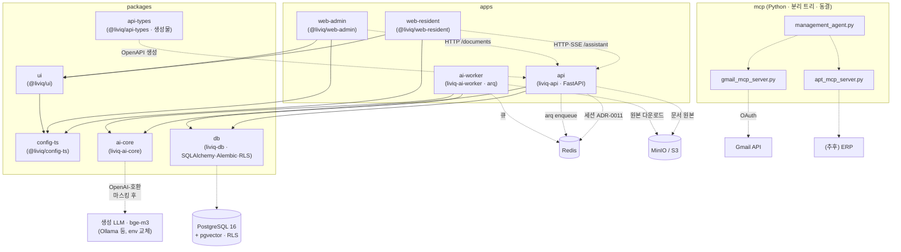

# ARCHITECTURE

LIVIQ 모노레포의 모듈 구성과 의존 관계. 상세 시스템 설계는
[docs/01-architecture.md](docs/01-architecture.md), 디렉토리 규약은
[docs/02-directory-structure.md](docs/02-directory-structure.md) 참고.

이 문서는 **cross-module 의존성**을 한눈에 보여 변경 영향(ripple)을 추적하기 위한 것이다.

## 현재 모듈 의존 그래프

실선 = 실제 코드 의존, 점선 = 런타임/외부 연동.

백엔드는 Python(FastAPI·SQLAlchemy·arq), 웹은 TypeScript — 언어 구도·근거는 [ADR-0013](docs/adr/0013-python-backend.md).

**H1(RAG MVP)+H2(입주민/관리자 기능) 완료 상태**: ai-core는 RAG 전체(LLM 클라이언트·PII 마스킹·검색·인용검증·오케스트레이터),
ai-worker는 문서 인제스트(파싱→청킹→임베딩→pgvector), api는 `documents`·`assistant` SSE에 더해
**정식 인증 스택** — Redis 세션([ADR-0011](docs/adr/0011-redis-server-session.md))·자체 이메일+비밀번호 인증(Argon2id·검증 메일·auth_tokens, [ADR-0014](docs/adr/0014-local-email-auth.md))·역할 인가 가드(`require_roles`)·
PII 봉투 암호화([ADR-0010](docs/adr/0010-envelope-encryption-env-master-key.md), `tenant_keys`)·온보딩·가입 승인·명부 업로드.
dev 헤더(`X-Dev-*`)는 local 보조 경로로만 동작.
화면 실연동(H6 완료): **양 앱 전 화면 실연동·목업 0** — web-resident 홈·비서·민원·공지·관리비·나/알림함·온보딩, web-admin 대시보드·문서·민원·공지 초안·관리비·검수 큐·시설·가입 승인/명부. 웹 인증은 세션 쿠키 1차(credentials CORS, H6-1), 인증 수단은 H7-1에서 자체 이메일 인증으로 교체(E2E는 시드 계정 API 로그인, 가입 여정 spec은 H7-3·H7-4 재작성까지 skip).
시설 쓰기는 PG 트랜잭션+`outbox_events` 원자 기록(H3-1) — Neo4j 반영은 ai-worker graph-sync(H3-2, arq cron 15초)가
outbox 폴링으로 단독 수행. 그래프 접근은 ai-core `graph/` typed query 레이어만(raw Cypher 비노출, 격리 CRITICAL 테스트).
`/assistant/ask`는 읽기 전용 도구호출 에이전트(H3-3, [ADR-0007](docs/adr/0007-readonly-tool-agent.md)) — ai-core `tools/`
레지스트리 6종(역할·그래프 가용성 필터, tenant·user는 코드 주입), 스텝 상한 3, 도구 인용은 `source_kind=tool:*`
(SSE citation은 document_id null). Neo4j env 없으면 그래프 도구만 제외(PG 폴백).
시설 AI 도우미 `POST /admin/facilities/assistant`(H3-4)는 같은 에이전트에 시설 프롬프트(원인 후보·단정 금지)만
주입해 공유 — done 이벤트 `tool_path`로 도구 경로 관측(evals 규칙 8 실측).
AI 질의 앞단(H4): Redis 레이트 리밋(사용자·단지, 429·fail-open)과 정확 캐시([docs/08 §2.0](docs/08-llm-token-optimization.md)
스코프 키+인제스트 세대 무효화, 히트 시 LLM 0) — 운영 대시보드 `GET /admin/dashboard/stats`(집계·캐시 적중률·일일 토큰 예산 경고).
web-resident의 SSE 이벤트 타입은 로컬 정의(api-types 소비 전환은 백로그, [docs/09 §8.3](docs/09-implementation-harness.md)).
E2E는 `tests/e2e`(@liviq/e2e, Playwright — H2-7): 결정론 여정 4종이 CI 게이트, `@llm` 태그 여정은 로컬 전용.

## Cross-Module 의존성 표

| 모듈 | 의존 대상 | 종류 | 변경 시 영향 |
|------|-----------|------|--------------|
| `apps/web-resident` | `@liviq/ui`, `@liviq/config-ts` | build | UI 토큰/컴포넌트 변경이 화면에 직결 |
| `apps/web-admin` | `@liviq/ui`, `@liviq/config-ts` | build | 상동 (검수 큐·공지 초안 UI) |
| `@liviq/ui` | `@liviq/config-ts` | build | tsconfig 변경이 빌드 산출물에 영향 |
| `apps/api` (liviq-api) | `liviq-db`, `liviq-ai-core` | build(uv workspace) | 스키마·ai-core 인터페이스 변경이 API에 직결 |
| `apps/ai-worker` | `liviq-db`, `liviq-ai-core` | build(uv workspace) | 상동 (인제스트·동기화 파이프라인) |
| `@liviq/api-types` | `apps/api` OpenAPI | 생성물 | api 스키마 변경 시 `pnpm generate:api-types` 재생성 필수(CI 드리프트 게이트) |
| `liviq-db` | PostgreSQL(pgvector·RLS) | runtime | 마이그레이션 변경 = `pnpm db:migrate` + RLS 테스트(CRITICAL) |
| `mcp/management_agent.py` | `gmail_mcp_server`, `apt_mcp_server` | runtime | 툴 인터페이스 변경 시 에이전트 조정 필요 |
| `mcp/*` | Gmail API, 관리 시스템 | 외부 | 크레덴셜·스키마 변경에 취약 |

## Ripple 인덱스 — 여기를 바꾸면 무엇을 돌려야 하나

위 표의 **역방향**. "X를 바꾸면 어디가 깨지고 어떤 검증을 돌려야 하나"에 즉답한다.
명령은 모두 실존 스크립트(루트 `package.json`·각 패키지 `scripts`·`turbo.json`)다.

| 변경 지점 | 영향 범위 | 실행할 검증 |
|-----------|-----------|-------------|
| `packages/ui/src/components/*` (공유 컴포넌트) | web-resident·web-admin 화면 전체 | `pnpm --filter @liviq/ui test`, 이어 `pnpm typecheck`·`pnpm build` |
| `packages/ui/src/lib/*` (`cx` 등 유틸) | ui 컴포넌트 전체 + 양 앱 | `pnpm --filter @liviq/ui test` 먼저, 이어 `pnpm build` |
| `packages/config-ts` (tsconfig·eslint 프리셋) | 전 TS 워크스페이스 | `pnpm typecheck` · `pnpm lint` · `pnpm build` |
| `apps/web-admin/src/features/*` (검수 큐 등) | web-admin 단독 (leaf) | `pnpm --filter @liviq/web-admin test` · `pnpm --filter @liviq/web-admin typecheck` |
| `apps/web-resident/src/lib/*` | web-resident 단독 (leaf) | `pnpm --filter @liviq/web-resident test` |
| `packages/db/src/liviq_db/models/*`·`alembic/` | api·ai-worker + DB 스키마 | `pnpm --filter @liviq/db test`(RLS 포함) · `pnpm db:migrate` |
| `apps/api/app/*` (스키마·라우터) | web-* 타입 계약 | `pnpm --filter @liviq/api test` · `pnpm generate:api-types`(드리프트 0 확인) |
| 루트 `pyproject.toml`·`uv.lock` | Python 4패키지 전체 | `uv sync --all-packages` 후 `pnpm test` |
| `CLAUDE.md`·`docs/`·모듈 `CLAUDE.md` (컨텍스트 문서) | AI 에이전트 동작·경로 무결성 | `node scripts/check-context-paths.mjs` (= `pnpm check:paths`) |
| `mcp/*` | 동결됨([ADR-0008](docs/adr/0008-freeze-mcp-prototype.md)) — 원칙상 수정 없음 | 예외 수정 시 CI `.github/workflows/python-mcp.yml` |
| `apps/web-*` 화면·`apps/api` 라우터 (E2E 여정 경로) | `tests/e2e` 여정 셀렉터·시드 계약 | `pnpm e2e` (infra 기동 필요 — turbo 게이트 밖, CI e2e 잡이 커버) |
| `turbo.json`·`pnpm-workspace.yaml`·루트 `package.json` | 전 워크스페이스 빌드 파이프라인 | `pnpm build` |

> `packages/config-ts`에는 자체 `scripts`가 없다(프리셋만 제공) — 검증은 이를 소비하는 워크스페이스 전체로 돌린다.

## 경계 규칙 (Why)

- `packages/ui`는 앱을 import하지 않는다(단방향). Why: 순환 의존 방지·재사용.
- `mcp/`(Python)는 TS 워크스페이스와 코드 공유 없음. 계약은 MCP 프로토콜로만. Why: 언어 경계.
- 외부(ERP/LLM/Gmail)는 어댑터 뒤에 둔다. Why: 교체 가능성·마스킹 삽입 지점 확보([docs/06](docs/06-security-privacy.md)).
- 개인정보는 LLM 경계를 넘기 전 반드시 마스킹(fail-closed, self-hosted 포함). Why: 절대규칙 2.
