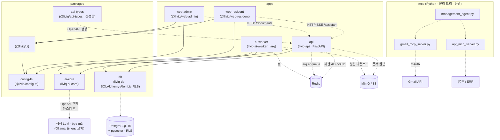

# ARCHITECTURE

LIVIQ 모노레포의 모듈 구성과 의존 관계. 상세 시스템 설계는
[docs/01-architecture.md](docs/01-architecture.md), 디렉토리 규약은
[docs/02-directory-structure.md](docs/02-directory-structure.md) 참고.

이 문서는 **cross-module 의존성**을 한눈에 보여 변경 영향(ripple)을 추적하기 위한 것이다.

## 현재 모듈 의존 그래프

실선 = 실제 코드 의존, 점선 = 런타임/외부 연동.

```mermaid
graph TD
  subgraph apps
    R["web-resident<br/>(@liviq/web-resident)"]
    A["web-admin<br/>(@liviq/web-admin)"]
    API["api<br/>(liviq-api · FastAPI)"]
    W["ai-worker<br/>(liviq-ai-worker · arq)"]
  end
  subgraph packages
    UI["ui<br/>(@liviq/ui)"]
    CFG["config-ts<br/>(@liviq/config-ts)"]
    APIT["api-types<br/>(@liviq/api-types · 생성물)"]
    AIC["ai-core<br/>(liviq-ai-core)"]
    DB["db<br/>(liviq-db · SQLAlchemy·Alembic·RLS)"]
  end
  subgraph python["mcp (Python · 분리 트리 · 동결)"]
    MA["management_agent.py"]
    GM["gmail_mcp_server.py"]
    APT["apt_mcp_server.py"]
  end

  R --> UI
  A --> UI
  R --> CFG
  A --> CFG
  UI --> CFG
  R -.->|HTTP·SSE /assistant| API
  A -.->|HTTP /documents| API
  APIT -.->|OpenAPI 생성| API
  API --> AIC
  API --> DB
  W --> AIC
  W --> DB
  DB -.-> PG[("PostgreSQL 16<br/>+ pgvector · RLS")]
  API -.->|세션 ADR-0011| REDIS[("Redis")]
  API -.->|arq enqueue| REDIS
  W -.->|큐| REDIS
  API -.->|문서 원본| S3[("MinIO / S3")]
  W -.->|원본 다운로드| S3
  AIC -.->|OpenAI-호환<br/>마스킹 후| LLM["생성 LLM · bge-m3<br/>(Ollama 등, env 교체)"]

  MA -.-> GM
  MA -.-> APT
  GM -.->|OAuth| EXT["Gmail API"]
  APT -.-> ERP["(추후) ERP"]
```

백엔드는 Python(FastAPI·SQLAlchemy·arq), 웹은 TypeScript — 언어 구도·근거는 [ADR-0013](docs/adr/0013-python-backend.md).

**H1(RAG MVP)+H2(입주민/관리자 기능) 완료 상태**: ai-core는 RAG 전체(LLM 클라이언트·PII 마스킹·검색·인용검증·오케스트레이터),
ai-worker는 문서 인제스트(파싱→청킹→**마스킹**→임베딩→pgvector — 항상 최신 버전만, H8-2; 임베딩도 LLM 경계라 원문 미전송, 규칙 2), api는 `documents`·`assistant` SSE에 더해
**정식 인증 스택** — Redis 세션([ADR-0011](docs/adr/0011-redis-server-session.md))·자체 이메일+비밀번호 인증(Argon2id·검증 메일·auth_tokens, [ADR-0014](docs/adr/0014-local-email-auth.md))·역할 인가 가드(`require_roles`)·
PII 봉투 암호화([ADR-0010](docs/adr/0010-envelope-encryption-env-master-key.md), `tenant_keys`)·온보딩·가입 승인·명부 업로드.
dev 헤더(`X-Dev-*`)는 local 보조 경로로만 동작.
화면 실연동(H6 완료): **양 앱 전 화면 실연동·목업 0** — web-resident 홈·비서·민원·공지·관리비·나/알림함·온보딩, web-admin 대시보드·문서·민원·공지사항·관리비·시설·주민 관리. 웹 인증은 세션 쿠키 1차(credentials CORS, H6-1), 인증 수단은 H7에서 자체 이메일 인증으로 교체 — 가입 여정 E2E(설치→단지→초대→명부→가입→승인)가 CI 게이트(H7-4).
공지는 **AI 미개입 일반 게시판**(H8-1, [ADR-0015](docs/adr/0015-notice-board-replaces-ai-draft.md)) — 작성·수정·삭제(soft)·상단 고정·임시저장·예약 발행(ai-worker arq cron 1분, `worker_scheduled_scan` RLS)·첨부(`notice_attachments`, MinIO, 다운로드 API 경유·인가 CRITICAL). 작성·발행은 MANAGER·STAFF.
공지 벡터화(H8-3): **published 공지만** 본문+파싱 가능 첨부(.pdf/.txt/.md)를 `content_chunks(source_type=notice)`로 인제스트(발행·published 수정·첨부 변경 시 재인제스트 enqueue, soft delete 시 청크 즉시 삭제). 검색은 notices 조인(published·미삭제)으로 미발행 미노출 이중 방어(CRITICAL) — 작성·발행 경로 AI 미개입 원칙은 불변.
문서관리는 H8-2([ADR-0016](docs/adr/0016-document-board-versioned-attachment.md))에서 **관리자 전용 게시판**으로 전환 — 게시글=제목+본문(설명용·임베딩 제외)+첨부 1개 필수(.pdf/.txt/.md), 재업로드=`document_versions` version+1+자동 재인제스트(벡터는 최신만), 이력 다운로드 전용(롤백 없음), soft delete 시 청크 즉시 삭제. 제목은 경계에서 NFC 정규화한다(`DocumentTitle` — 작성 Form·PATCH 양쪽, macOS 파일명의 NFD가 화면 검색·SQL LIKE 불일치를 냈다, H20-14). 청크는 `content_chunks`(document|notice 다형)로 일반화 — H8-3 공지 벡터화가 스키마 변경 없이 진입.
설정 인프라(H8-4, [ADR-0017](docs/adr/0017-tenant-code-registry.md)): 관리자 **설정** 메뉴(MANAGER 전용) 하위 **코드 관리** — tenant 스코프 계층 공통 코드(`code_groups`·`codes`, 자기참조 parent). 분류 하드코딩 대체 — NOTICE_CATEGORY·DOC_CATEGORY 기본 시드(단지 생성·마이그레이션), is_system 그룹 잠금·도메인 FK RESTRICT. 설정 하위 **동/호수 관리**(H8-5): `buildings`·`households` CRUD·층/호 범위 일괄 생성, 세대 삭제는 입주민·명부·민원·관리비·기기 FK 연결 시 409(CRITICAL).
코드 적용(H8-6): notices에 `category_code_id`(NOTICE_CATEGORY·NULL 허용)·`event_start/end`·`target_buildings`·`keywords`(벡터화 임베딩 포함), documents `source_type`→`category_code_id`(DOC_CATEGORY·NOT NULL, 기존 데이터 label 매핑) 전환. 코드가 도메인 FK(RESTRICT) 참조 대상 — 사용 중 코드 삭제는 409.
시설 쓰기는 PG 트랜잭션+`outbox_events` 원자 기록(H3-1) — Neo4j 반영은 ai-worker graph-sync(H3-2, arq cron 15초)가
outbox 폴링으로 단독 수행. 그래프 접근은 ai-core `graph/` typed query 레이어만(raw Cypher 비노출, 격리 CRITICAL 테스트).
`/assistant/ask`는 읽기 전용 도구호출 에이전트(H3-3, [ADR-0007](docs/adr/0007-readonly-tool-agent.md)) — ai-core `tools/`
레지스트리 **17종**(역할·그래프 가용성 필터, tenant·user는 코드 주입 — 목록은 [docs/01 §5.2](docs/01-architecture.md)),
스텝 상한 4(H18 계획 turn 포함), 도구 인용은 `source_kind=tool:*`
(SSE citation은 document_id null). Neo4j env 없으면 그래프 도구만 제외(PG 폴백).
관리비는 조회 `get_fees`(본인 세대 · `scope`로 동·전체 평균)와 비교 `compare_fees`(대상 축 2~4개 —
서로 다른 달이 오면 **기간 축**으로 전환해 두 달을 나란히, H20-18)로 갈리고, 세대 평면도는
`find_in_floor_plan`(입주민)·`find_household_devices`(관리자), 주차는 `find_nearest_available_parking`·
`find_my_vehicle`·`find_longterm_parking`, 민원은 `search_similar_inquiries`·`get_my_inquiries`·
`summarize_inquiries`가 맡는다.
민원 트리아지(H17-1, [ADR-0024](docs/adr/0024-assistant-inquiry-triage.md))는 도구 추가 1종으로 끝난다 —
접수는 프론트가 `tool_path`를 보고 띄우는 프리필 딥링크이고 **AI는 쓰기를 하지 않는다**(규칙 8).
관리자 채널(`POST /admin/assistant/ask`·`channel="admin"`, H20-2 [ADR-0028](docs/adr/0028-admin-assistant-home.md))은
같은 에이전트를 태우되 **도구 가시성과 되묻기 여부를 코드가 정한다** — 라우터 `_admin_overrides`
(`apps/api/app/routers/assistant.py`)가 평면도 요소·위치 어휘와 동·호수 유무로 갈라
관리자 프롬프트(`ADMIN_ANSWER_SYSTEM_PROMPT` 규칙 7 · 동·호수 없으면 `ADMIN_AGENT_ASK_UNIT_PROMPT`로 되묻기)와
`exclude_tools`를 넘긴다(H20-16·17·17b). 8B가 프롬프트 조건문으로는 이 분기를 지키지 못했기 때문이다(실측).
조회 대상 세대도 LLM 인자가 아니라 `ToolContext.target_unit`·`target_query`로 **코드가 주입**한다 —
마스킹 뒤 모델 눈에는 `<PII:UNIT:1>`뿐이고(규칙 2), 세대 지정을 모델에 맡기면 착오가 곧 타 세대 조회다(규칙 4).
시설 AI 도우미 `POST /admin/facilities/assistant`(H3-4)는 같은 에이전트에 시설 프롬프트(원인 후보·단정 금지)만
주입해 공유 — done 이벤트 `tool_path`로 도구 경로 관측(evals 규칙 8 실측).
AI 질의 앞단(H4): Redis 레이트 리밋(사용자·단지, 429·fail-open)과 정확 캐시([docs/08 §2.0](docs/08-llm-token-optimization.md)
스코프 키+인제스트 세대 무효화, 히트 시 LLM 0) — 운영 대시보드 `GET /admin/dashboard/stats`(집계·캐시 적중률·일일 토큰 예산 경고).
web-resident의 SSE 이벤트 타입은 로컬 정의(api-types 소비 전환은 백로그, [docs/09 §8.3](docs/09-implementation-harness.md)).
관리자 공간정보 화면(H9, [ADR-0019](docs/adr/0019-complex-twin-3d.md))은 **읽기 전용 조회 배선**이다 — 트윈은
`household_geometries` + `/admin/twin/*`(geometry·overlay·세대 상세) + web-admin `/twin`(deck.gl ↔ VWorld/Cesium iframe 토글),
주차장(H9-5·H16)은 `parking_layouts`(단지당 1행·`layout` JSONB — viewBox·동 footprint·442면 spots)·`parking_vehicles`(입주민 348대+외부 8대·차량번호는
`plate_enc` 봉투 암호화)를 `GET /admin/parking/layout`·`GET /admin/parking/vehicles`(**MANAGER** 전용, plate 복호)로 읽어
web-admin `/parking`이 SVG 배치도로 렌더한다. 적재 경로는 API가 아니라 시드 스크립트다
(`apps/api/scripts/seed_parking.py` + `scripts/data/parking_layout.json`·`parking_vehicles.json` — 전량 교체 멱등).
**면 점유 상태도 DB가 단일 출처다**(H16 — `spot_no`·`entry_at`·부분 유니크 `(tenant_id, spot_no)`, 외부 차량은 `household_id NULL`).
시드가 결정적 배정(고정 시드·재실률 0.75·자기 동 근처 선호)하고, 웹은 인덱싱만 한다
(`parking-sim.ts`의 `occupancyFromVehicles` — 입출차 카메라(번호판 인식) 연동 시 시드 경로만 교체).
렌더러는 2D `ParkingMap`·3D `ParkingScene3D` 둘 다 `@liviq/ui` 공용이고 web-admin·web-resident가 함께 소비한다
(H17-2·H20-8, 카메라·비콘 수정은 씬 1곳 = 양 앱 반영 — H20-15).
차량번호는 관리자 세션에만 복호 노출하고 입주민 앱·LLM 경로에는 흐르지 않는다([docs/06 §4](docs/06-security-privacy.md)).
E2E는 `tests/e2e`(@liviq/e2e, Playwright — H2-7): 결정론 여정 4종이 CI 게이트, `@llm` 태그 여정은 로컬 전용.

## Cross-Module 의존성 표

| 모듈 | 의존 대상 | 종류 | 변경 시 영향 |
|------|-----------|------|--------------|
| `apps/web-resident` | `@liviq/ui`, `@liviq/config-ts` | build | UI 토큰/컴포넌트 변경이 화면에 직결 |
| `apps/web-admin` | `@liviq/ui`, `@liviq/config-ts` | build | 상동 (공지사항 게시판·문서 게시판 UI) |
| `@liviq/ui` | `@liviq/config-ts` | build | tsconfig 변경이 빌드 산출물에 영향 |
| `apps/api` (liviq-api) | `liviq-db`, `liviq-ai-core` | build(uv workspace) | 스키마·ai-core 인터페이스 변경이 API에 직결 |
| `apps/ai-worker` | `liviq-db`, `liviq-ai-core` | build(uv workspace) | 상동 (인제스트·동기화 파이프라인) |
| `@liviq/api-types` | `apps/api` OpenAPI | 생성물 | api 스키마 변경 시 `pnpm generate:api-types` 재생성 필수(CI 드리프트 게이트) |
| `liviq-db` | PostgreSQL(pgvector·RLS) | runtime | 마이그레이션 변경 = `pnpm db:migrate` + RLS 테스트(CRITICAL) |
| `mcp/management_agent.py` | `gmail_mcp_server`, `apt_mcp_server` | runtime | 툴 인터페이스 변경 시 에이전트 조정 필요 |
| `mcp/*` | Gmail API, 관리 시스템 | 외부 | 크레덴셜·스키마 변경에 취약 |

## Ripple 인덱스 — 여기를 바꾸면 무엇을 돌려야 하나

위 표의 **역방향**. "X를 바꾸면 어디가 깨지고 어떤 검증을 돌려야 하나"에 즉답한다.
명령은 모두 실존 스크립트(루트 `package.json`·각 패키지 `scripts`·`turbo.json`)다.

| 변경 지점 | 영향 범위 | 실행할 검증 |
|-----------|-----------|-------------|
| `packages/ui/src/components/*` (공유 컴포넌트) | web-resident·web-admin 화면 전체 | `pnpm --filter @liviq/ui test`, 이어 `pnpm typecheck`·`pnpm build` |
| `packages/ui/src/lib/*` (`cx` 등 유틸) | ui 컴포넌트 전체 + 양 앱 | `pnpm --filter @liviq/ui test` 먼저, 이어 `pnpm build` |
| `packages/config-ts` (tsconfig·eslint 프리셋) | 전 TS 워크스페이스 | `pnpm typecheck` · `pnpm lint` · `pnpm build` |
| `apps/web-admin/src/features/*` (공지·문서 등) | web-admin 단독 (leaf) | `pnpm --filter @liviq/web-admin test` · `pnpm --filter @liviq/web-admin typecheck` |
| `apps/web-resident/src/lib/*` | web-resident 단독 (leaf) | `pnpm --filter @liviq/web-resident test` |
| `packages/db/src/liviq_db/models/*`·`alembic/` | api·ai-worker + DB 스키마 | `pnpm --filter @liviq/db test`(RLS 포함) · `pnpm db:migrate` |
| `apps/api/app/*` (스키마·라우터) | web-* 타입 계약 | `pnpm --filter @liviq/api test` · `pnpm generate:api-types`(드리프트 0 확인) |
| 루트 `pyproject.toml`·`uv.lock` | Python 4패키지 전체 | `uv sync --all-packages` 후 `pnpm test` |
| `CLAUDE.md`·`docs/`·모듈 `CLAUDE.md` (컨텍스트 문서) | AI 에이전트 동작·경로 무결성 | `node scripts/check-context-paths.mjs` (= `pnpm check:paths`) |
| `mcp/*` | 동결됨([ADR-0008](docs/adr/0008-freeze-mcp-prototype.md)) — 원칙상 수정 없음 | 예외 수정 시 CI `.github/workflows/python-mcp.yml` |
| `apps/web-*` 화면·`apps/api` 라우터 (E2E 여정 경로) | `tests/e2e` 여정 셀렉터·시드 계약 | `pnpm e2e` (infra 기동 필요 — turbo 게이트 밖, CI e2e 잡이 커버) |
| `turbo.json`·`pnpm-workspace.yaml`·루트 `package.json` | 전 워크스페이스 빌드 파이프라인 | `pnpm build` |

> `packages/config-ts`에는 자체 `scripts`가 없다(프리셋만 제공) — 검증은 이를 소비하는 워크스페이스 전체로 돌린다.

## 경계 규칙 (Why)

- `packages/ui`는 앱을 import하지 않는다(단방향). Why: 순환 의존 방지·재사용.
- `mcp/`(Python)는 TS 워크스페이스와 코드 공유 없음. 계약은 MCP 프로토콜로만. Why: 언어 경계.
- 외부(ERP/LLM/Gmail)는 어댑터 뒤에 둔다. Why: 교체 가능성·마스킹 삽입 지점 확보([docs/06](docs/06-security-privacy.md)).
- 개인정보는 LLM 경계를 넘기 전 반드시 마스킹(fail-closed, self-hosted 포함). Why: 절대규칙 2.
