# 03. 데이터베이스 설계서

> 아키텍처: [01-architecture.md](01-architecture.md) · 데이터 아키텍처: [11-data-architecture.md](11-data-architecture.md) · 보안/개인정보: [06-security-privacy.md](06-security-privacy.md)
> 엔진: PostgreSQL 16 + pgvector(HNSW) · ORM: Drizzle · 모든 테이블 `snake_case`

## 1. 설계 원칙

1. **멀티테넌시**: 모든 업무 테이블에 `tenant_id`(단지) + **RLS** 강제.
2. **개인정보 분리**: 식별정보는 `pii_vault`에 분리·암호화 저장, 업무 테이블은 참조키만.
3. **불변/감사**: 핵심 행위는 `audit_logs`에 추가-only 기록.
4. **관리비 원천**: 관리자 **엑셀 업로드**가 현재 원천(추후 ERP 어댑터 병행 여지). AI는 **설명만**(계산·부과 금지).
5. **벡터 배치 분리**: 문서 임베딩은 `document_chunks`(pgvector), 시설 텍스트 임베딩은 **Neo4j 벡터 인덱스**에만 — 중복 저장 금지([11-data-architecture.md](11-data-architecture.md)).

## 2. ERD (개념)

> 컬럼은 PK/FK·핵심만 표기(전량 나열 아님). 모든 업무 테이블은 `tenant_id`를 보유하며 RLS로 격리(§5). 시설 그래프·시설 텍스트 벡터는 파생 스토어(Neo4j)로 투영 — [11](11-data-architecture.md).

```mermaid
erDiagram
  tenants ||--o{ buildings : "동"
  tenants ||--o{ unit_types : "타입"
  tenants ||--o{ users : "계정"
  tenants ||--o{ documents : "문서"
  tenants ||--o{ conversations : "대화"
  tenants ||--o{ inquiries : "민원"
  tenants ||--o{ notices : "공지"
  tenants ||--o{ facilities : "시설"
  tenants ||--o{ excel_uploads : "업로드"
  tenants ||--o{ outbox_events : "이벤트"
  tenants ||--o{ audit_logs : "감사"
  tenants ||--o{ jobs : "작업"
  tenants ||--o{ notifications : "알림"
  buildings ||--o{ households : "세대"
  unit_types ||--o{ households : "타입참조"
  unit_types ||--o{ floor_plans : "평면도"
  floor_plans ||--o{ plan_devices : "장치"
  facilities ||--o| plan_devices : "포인트"
  households ||--o{ users : "거주"
  households ||--o{ inquiries : "제기"
  households ||--o{ fees : "관리비"
  users ||--o| pii_vault : "분리저장"
  users ||--o{ user_roles : "역할"
  users ||--o{ consents : "동의"
  users ||--o{ notifications : "수신"
  documents ||--o{ document_chunks : "청크"
  document_chunks ||--o{ citations : "근거"
  conversations ||--o{ messages : "메시지"
  messages ||--o{ citations : "인용"
  messages ||--o{ ai_feedback : "피드백"
  notices ||--o{ notice_drafts : "초안"
  facilities ||--o{ maintenance_logs : "정비"
  facilities ||--o{ incidents : "장애"
  excel_uploads ||--o{ fees : "적용"

  tenants {
    uuid id PK
    string name
    jsonb settings
  }
  buildings {
    uuid id PK
    uuid tenant_id FK
    string name
    int floors
  }
  households {
    uuid id PK
    uuid tenant_id FK
    uuid building_id FK
    uuid unit_type_id FK
    int floor
    int unit_no
  }
  unit_types {
    uuid id PK
    uuid tenant_id FK
    string name
  }
  floor_plans {
    uuid id PK
    uuid tenant_id FK
    string scope
    uuid unit_type_id FK
    string image_key
  }
  plan_devices {
    uuid id PK
    uuid tenant_id FK
    uuid floor_plan_id FK
    uuid household_id FK
    uuid facility_id FK
    string device_type
    numeric x
    numeric y
  }
  users {
    uuid id PK
    uuid tenant_id FK
    uuid household_id FK
    string login_id "OAuth sub, 사전등록 NULL"
    string status
    bool roster_matched
    uuid pii_ref FK
  }
  pii_vault {
    uuid id PK
    uuid tenant_id FK
    bytea name_enc
    bytea phone_enc
    string name_hash
  }
  user_roles {
    uuid id PK
    uuid user_id FK
    string role
  }
  consents {
    uuid id PK
    uuid user_id FK
    string purpose
    bool granted
  }
  documents {
    uuid id PK
    uuid tenant_id FK
    string title
    string source_type
    string index_status
  }
  document_chunks {
    uuid id PK
    uuid tenant_id FK
    uuid document_id FK
    text content
    vector embedding
  }
  conversations {
    uuid id PK
    uuid tenant_id FK
    uuid user_id FK
    string channel
  }
  messages {
    uuid id PK
    uuid tenant_id FK
    uuid conversation_id FK
    string role
    string intent
    numeric confidence
  }
  citations {
    uuid id PK
    uuid message_id FK
    string source_kind
    uuid document_id FK "NULL 허용"
    uuid chunk_id FK "NULL 허용"
    text quote
  }
  ai_feedback {
    uuid id PK
    uuid message_id FK
    string rating
  }
  inquiries {
    uuid id PK
    uuid tenant_id FK
    uuid household_id FK
    string status
    uuid assignee_user_id FK
  }
  notices {
    uuid id PK
    uuid tenant_id FK
    string title
    string status
  }
  notice_drafts {
    uuid id PK
    uuid tenant_id FK
    uuid notice_id FK
    string review_status
  }
  notifications {
    uuid id PK
    uuid tenant_id FK
    uuid user_id FK
    string type
    string title
    timestamptz read_at
  }
  facilities {
    uuid id PK
    uuid tenant_id FK
    string name
    string status
  }
  maintenance_logs {
    uuid id PK
    uuid tenant_id FK
    uuid facility_id FK
    text work
  }
  incidents {
    uuid id PK
    uuid tenant_id FK
    uuid facility_id FK
    text symptom
    text resolution
  }
  fees {
    uuid id PK
    uuid tenant_id FK
    uuid household_id FK
    string period
    jsonb breakdown
    numeric total_amount
    uuid upload_id FK
  }
  excel_uploads {
    uuid id PK
    uuid tenant_id FK
    string type
    string period
    string status
  }
  outbox_events {
    uuid id PK
    uuid tenant_id FK
    string aggregate_type
    uuid aggregate_id
    string status
  }
  audit_logs {
    uuid id PK
    uuid tenant_id FK
    string action
    uuid target_id
  }
  jobs {
    uuid id PK
    uuid tenant_id FK
    string type
    string status
  }
```



## 3. 공통 컬럼 규약

모든 업무 테이블: `id (uuid pk)`, `tenant_id (uuid, fk→tenants)`, `created_at`, `updated_at`.

- **금액**: `numeric(12,0)` — KRW **원 단위 정수**(소수 없음). 계산·부과는 원천 데이터, AI는 설명만(§1).
- **시각**: `timestamptz`(UTC 저장), 표시는 `Asia/Seoul`.
- **soft delete**: `deleted_at timestamptz NULL` 적용 테이블 = `documents`·`notices`·`inquiries`·`facilities`·`users`. 이 테이블의 `UNIQUE`는 **partial unique index** `WHERE deleted_at IS NULL`로 걸어 삭제 후 재등록을 허용.
- **updated_at**: DB 트리거로 자동 갱신(앱 누락 방지).
- 개인정보 포함 테이블은 보관기간·파기 정책 적용([06 §4.4](06-security-privacy.md)).

## 4. 핵심 테이블

### 4.1 테넌시·계정

```sql
-- 단지
tenants(id, name, address, status, settings jsonb, created_at, updated_at)

-- 동 (마스터)
buildings(id, tenant_id, name, floors int, created_at, updated_at)
  UNIQUE(tenant_id, name)

-- 세대 (동·층·호로 구조화)
households(id, tenant_id, building_id, floor int, unit_no int,
           unit_type_id NULL,             -- 평면도 타입 참조(unit_types.id, §4.8)
           status, created_at, updated_at)
  UNIQUE(tenant_id, building_id, floor, unit_no)

-- 사용자 (식별정보는 pii_vault로 분리)
users(id, tenant_id, household_id NULL,
      login_id UNIQUE NULL,          -- OAuth subject(Google sub). 명부 사전등록 행은 NULL
      status,                        -- pre_registered|pending|active|inactive|rejected|withdrawn
                                     --   inactive=전출(1년 보관) · withdrawn=탈퇴(즉시 비식별, [06 §4.4])
      roster_matched bool,           -- 가입 시 명부 사전등록 행과 자동 대조 일치 여부
      pii_ref uuid NULL,             -- pii_vault.id
      approved_by NULL, approved_at NULL, rejected_reason NULL,  -- 소장 승인/거절
      created_at, updated_at)

-- 역할 (다대다)
user_roles(id, tenant_id, user_id, role)   -- role: RESIDENT|MANAGER|STAFF|FACILITY|COUNCIL|SYS_ADMIN
  UNIQUE(tenant_id, user_id, role)

-- 개인정보 분리 저장 (암호화)
pii_vault(id, tenant_id, name_enc, phone_enc, email_enc, birth_date_enc,
          name_hash, phone_hash,     -- 검색용 해시(평문 저장 금지)
          created_at, updated_at)

-- 개인정보 동의
consents(id, tenant_id, user_id, purpose, granted bool, granted_at, revoked_at,
         policy_version)
```

> **명부 사전등록·온보딩**: 소장이 명부 엑셀(성함·생년월일·동·호)을 일괄 업로드하면 `users` 행이
> 사전 생성된다(`status=pre_registered`, `login_id=NULL`, PII는 `pii_vault`). 입주민이 Google OAuth로 로그인·정보 입력하면
> 사전등록 행과 **자동 대조**(성함+생일+동·호)한다 — 일치 시 해당 행에 `login_id`를 채우고 `roster_matched=true`로
> `pending` 전이(명부 일치 배지), 불일치 시 신규 행을 `pending`으로 만든다. 소장 최종 승인으로 `active`(거절은 `rejected`+사유).
> 전체 흐름: [11 §온보딩·명부](11-data-architecture.md).
>
> **명부 재업로드(diff 병합)**: 재업로드 시 기존 `pre_registered` 행과 (성함+생일+동·호) 키로 diff — 신규는 추가, 명부에서 사라진 행은 `inactive`(전출 추정) 표시(자동 삭제 금지, 소장 확인). 이미 `active`로 가입한 세대 계정은 유지.

### 4.2 문서·벡터 (RAG)

```sql
-- 원문 메타
documents(id, tenant_id, title, source_type,        -- 규약|회의록|공지|지침|매뉴얼
          visibility,                                -- ALL|RESIDENT|ADMIN|COUNCIL
          storage_key, content_hash, version,
          index_status,                              -- pending|indexing|indexed|failed
          uploaded_by, created_at, updated_at)
  UNIQUE(tenant_id, content_hash)                    -- 멱등 인제스트

-- 청크 + 임베딩
document_chunks(id, tenant_id, document_id,
                chunk_index, content text,
                heading, page int, clause,           -- 인용 정확도용 메타
                token_count int,
                embedding vector(1024),              -- bge-m3(1024) 고정
                created_at)
-- 인덱스
--   HNSW(embedding vector_cosine_ops)
--   btree(tenant_id, document_id)
```

> 벡터 검색은 항상 `WHERE tenant_id = $current AND visibility ∈ 허용` 선필터 후 ANN.
> visibility 매핑: `ALL`=인증 사용자 전체 · `RESIDENT`=입주민 · `ADMIN`=MANAGER·STAFF 열람 · `COUNCIL`=입주자대표회의.
> 임베딩 모델/차원 변경은 마이그레이션 이벤트(전량 재색인) — 함부로 바꾸지 않음.

### 4.3 대화·인용

```sql
conversations(id, tenant_id, user_id, channel,       -- resident|admin
              created_at, updated_at)

messages(id, tenant_id, conversation_id, role,       -- user|assistant|system
         content text, intent,                        -- ai|handoff (1차 분기와 정렬)
         confidence numeric NULL,                      -- 신뢰도
         status,                                       -- answered|fallback|handed_off
         review_status NULL,                           -- needs_review|approved|rejected
         token_input int, token_output int, cost_usd numeric,  -- [08] 비용추적
         created_at)

citations(id, tenant_id, message_id,
          source_kind,                                 -- document_chunk|fee_data|inquiry|facility|graph
          source_ref,                                  -- chunk_id 외 원천 식별자(fee period·facility_id 등)
          source_revision,                             -- 원천 버전(문서 version·관리비 period·upload_id)
          observed_at,                                 -- 근거 관측 시점
          document_id NULL, chunk_id NULL,             -- 문서 인용일 때만(그 외 NULL). chunk_id FK: ON DELETE SET NULL
          quote text, page int, clause)                -- 응답 근거 (실재 검증됨)
```

> **인용은 문서에 한정하지 않는다.** 문서 인용은 `source_kind`의 한 종류일 뿐, 도구 결과(관리비·민원·시설·그래프) 근거도 동일 테이블로 추적한다.
> 신뢰도 임계 미만 응답은 `messages.review_status=needs_review` + 사용자에겐 폴백 안내(사후 검수로 골든셋 개선).
> **과거 답변 출처 보존**: `chunk_id`는 청크 재색인·삭제 시 `ON DELETE SET NULL`. 원문 청크가 사라져도 `quote`·`source_revision`으로 답변 시점의 근거를 열람할 수 있다.

### 4.4 민원·공지

```sql
inquiry_categories(id, tenant_id, name, default_assignee_role, sla_hours)

inquiries(id, tenant_id, household_id, author_user_id,
          category_id NULL, title, body text,
          ai_suggested_category_id NULL, ai_priority,  -- urgent|normal|low (키워드 기반)
          status,                                       -- received|assigned|in_progress|done
          assignee_user_id NULL, attachments jsonb,
          created_at, updated_at)

notices(id, tenant_id, title, body text, status,       -- draft|published|retracted|superseded
        scheduled_at NULL,                              -- 예약 발송 시각(단일 컬럼; NULL=즉시). 발송 후 정정=superseded, 철회=retracted
        published_at, published_by, audience,           -- ALL|building|household
        created_at, updated_at)

notice_drafts(id, tenant_id, notice_id NULL, prompt_keywords jsonb,
              ai_body text, reviewed_by NULL, review_status,  -- pending|approved|rejected
              created_at)                                      -- 자동발송 금지: 검수 후 notices로 승격

-- 인앱 알림함 (앱 내 알림만, 외부 자동발송 아님)
notifications(id, tenant_id, user_id, type,            -- notice|inquiry_status|approval|system
              title, body text, link,                  -- link=앱 내 딥링크
              read_at NULL, created_at)                 -- RLS 대상(본인 알림만 열람)
```

### 4.5 시설·회의

```sql
facilities(id, tenant_id, name, location, type, status,   -- normal|check|fault|risk
           next_check_at, created_at, updated_at)

maintenance_logs(id, tenant_id, facility_id, performed_at,
                 work text, performer, parts jsonb, created_at)

incidents(id, tenant_id, facility_id, occurred_at, symptom text,
          resolution text, root_cause text NULL, created_at)
```

> **회의록은 별도 테이블 없이 `documents`(source_type=회의록)로 관리**한다.
> 회의 음성 STT·자동 요약은 추후 도입(그때 meetings/meeting_summaries 재설계).

> 단지 배치도·공용층 평면도의 시설 포인트(`plan_devices.facility_id`)는 `facilities`와 nullable FK로 연결한다(§4.8) — 추후 설비 상태맵 확장점.

> **시설 텍스트 임베딩은 PG에 저장하지 않는다.** 장애 증상·조치(`incidents.symptom`/`resolution`) 임베딩은
> Neo4j 노드 벡터 인덱스에만 둔다(중복 금지). Neo4j 노드는 `pg_id`·`tenant_id` 프로퍼티를 보유하며 PG가 SoR·Neo4j는 파생(재생성 가능),
> 모든 Cypher에 `tenant_id` 필터를 강제한다. 그래프 모델·동기화: [11-data-architecture.md](11-data-architecture.md).

### 4.6 관리비 (엑셀 업로드 원천, 추후 ERP 병행)

```sql
-- 관리자 엑셀 업로드가 원천. AI는 설명만(계산 X). 재업로드 = 해당 (tenant, period) 전 행 삭제 후 삽입(단일 트랜잭션, 전체 교체).
fees(id, tenant_id, household_id, period,            -- YYYY-MM
     breakdown jsonb,                                 -- 항목별 금액 {일반관리비, 청소비, 난방, ...}
     total_amount numeric,
     source,                                          -- excel | erp(추후)
     upload_id NULL,                                  -- excel_uploads.id
     created_at)
  UNIQUE(tenant_id, household_id, period)

-- 엑셀 업로드 이력 (관리비·명부 공통)
excel_uploads(id, tenant_id, type,                    -- fee | roster
              period NULL,                            -- fee일 때 YYYY-MM
              file_key, status,                       -- uploaded|validated|applied|failed
              row_count int, error_report jsonb,      -- 행 단위 검증 오류(세대 불일치 등)
              uploaded_by, created_at)
```

> 업로드 플로우: 업로드 → 파싱·Zod 검증 → 오류 리포트/미리보기 → 확정 적용. 확정 적용은 **해당 `(tenant_id, period)`의 기존 `fees` 전 행 삭제 후 재삽입**(단일 트랜잭션 = docs/11의 "전체 교체"). 상세: [11 §관리비 엑셀 업로드](11-data-architecture.md).

### 4.7 운영·AI 품질·작업

```sql
audit_logs(id, tenant_id, actor_user_id, action, target_type, target_id,
           meta jsonb, ip, created_at)                      -- append-only

ai_feedback(id, tenant_id, message_id, rating,             -- up|down
            reason text NULL, created_at)

ai_eval_golden(id, tenant_id NULL, question text,          -- NULL=공용 골든셋
               expected_answer text, expected_doc_id NULL,
               tags jsonb, created_at)

jobs(id, tenant_id, type,                                   -- ingest|ocr|reembed|eval
     ref_id, status, attempts int, error text NULL,
     created_at, updated_at)
```

> **`audit_logs` append-only 강제**: 런타임 DB role에 `INSERT`·`SELECT`만 `GRANT`, `UPDATE`·`DELETE`는 `REVOKE`(RLS와 동일한 마이그레이션 게이트에서 설정). 앱 코드 규율이 아니라 **권한으로 수정·삭제 차단**.

### 4.8 평면도·디지털트윈

배경 이미지(스캔 원본) + 좌표 레이어 방식(CAD 벡터화 아님). 마커는 정적 데이터(IoT 미연동, 추후 확장 여지).

```sql
-- 평면도 타입 (예: 84A)
unit_types(id, tenant_id, name, description, created_at, updated_at)

-- 평면도 (세대타입 / 동 공용층 / 단지 배치도 공통)
floor_plans(id, tenant_id, scope,               -- unit_type|building_common|site
            unit_type_id NULL, building_id NULL, floor_label NULL,
            image_key, image_width int, image_height int,   -- 원본 픽셀 크기
            version, created_at, updated_at)

-- 장치/포인트 (타입 기본 + 세대 오버라이드 단일 테이블)
plan_devices(id, tenant_id, floor_plan_id,
             household_id NULL,      -- NULL=타입 기본, 값=해당 세대 오버라이드
             base_device_id NULL,    -- move/hide 대상 기본 장치
             action,                 -- base|add|move|hide
             device_type,            -- entrance_door|room_door|window|outlet|breaker_box|router|facility_point|…
             x numeric, y numeric,   -- 배경 이미지 픽셀 좌표
             label, memo, photo_key NULL,
             facility_id NULL,       -- scope=site/building_common일 때 facilities 연결(nullable FK)
             created_at, updated_at)
```

**렌더 규칙**: 세대 평면도 = 타입 `base` 장치 − 세대 `hide` − 세대 `move`(대체) + 세대 `add`. 좌표계는 원본 이미지 픽셀, 프론트는 viewBox 스케일링.

**접근 통제**: 입주민은 **본인 세대**의 `floor_plans`/`plan_devices`만 열람. 타 세대 평면도 접근 절대 불가 — **RLS는 tenant 경계까지만 보장**하고, 본인 세대 한정은 **앱 소유권 검증**(`household_id` 일치)으로 강제한다([06]). 단지 배치도·공용층은 인증 입주민 공통 열람.

### 4.9 outbox (PG→Neo4j 동기화)

```sql
outbox_events(id, tenant_id, aggregate_type,          -- facility|incident|maintenance_log|plan_device
              aggregate_id, event_type,               -- created|updated|deleted
              sequence bigint,                        -- aggregate별 단조 증가(순서 보장)
              dedupe_key UNIQUE,                      -- 중복 이벤트 차단
              payload jsonb, status,                  -- pending|processed|failed
              attempts int, created_at, processed_at NULL)
```

> 시설 도메인 쓰기 트랜잭션에서 도메인 행과 `outbox_events`를 **원자적으로** 기록 → `ai-worker`가 순차 반영(MERGE). Neo4j는 파생·재생성 가능(전체 리플레이로 재구성). 상세 흐름: [11 §PG→Neo4j 동기화](11-data-architecture.md).
> **워커 처리 규칙**: `FOR UPDATE SKIP LOCKED`로 이벤트 claim(중복 처리 방지). Neo4j 노드에 `last_applied_version`을 저장해 더 오래된 이벤트는 거부(순서 역전 방지). delete는 노드 삭제가 아니라 **tombstone 이벤트**로 처리(지연 도착한 update가 삭제된 노드를 재생성하지 못하게). 최대 재시도 초과 시 **DLQ**(`status=failed`)로 격리 후 운영자가 재처리.
> **DLQ 정책**: `payload`는 aggregate **전체 스냅샷**. 한 이벤트가 DLQ로 격리돼도 **후속 이벤트 처리는 계속 진행**하며, DLQ 재처리는 중간 이벤트를 순차 재생하지 않고 **최신 스냅샷 리플레이**로 수렴시킨다.

## 5. RLS (행 수준 보안)

```sql
-- 모든 업무 테이블에 적용 (예: documents)
ALTER TABLE documents ENABLE ROW LEVEL SECURITY;
ALTER TABLE documents FORCE ROW LEVEL SECURITY;   -- owner도 우회 불가
CREATE POLICY tenant_isolation ON documents
  FOR ALL
  USING (tenant_id = nullif(current_setting('app.tenant_id', true), '')::uuid)
  WITH CHECK (tenant_id = nullif(current_setting('app.tenant_id', true), '')::uuid);
```
- API는 트랜잭션 시작 시 `SET LOCAL app.tenant_id = $`, `app.user_id`, `app.role` 설정.
- **마이그레이션 owner와 런타임 role 분리**: 런타임 role에 `BYPASSRLS` 부여 금지(테이블 owner는 기본 RLS를 우회하므로 `FORCE`로 차단).
- **트랜잭션 래퍼 강제**: 모든 쿼리는 tenant 컨텍스트가 설정된 트랜잭션 래퍼 안에서만 실행 — 래퍼 밖 쿼리는 구조적으로 금지.
- **composite FK로 cross-tenant 참조 차단**: 부모 `UNIQUE(tenant_id, id)` + 자식 `FK(tenant_id, parent_id) → 부모(tenant_id, id)`로 다른 단지 행 참조를 DB가 거부.
- **컨텍스트 미설정 시 fail-closed**: `app.tenant_id` 미설정이면 `nullif(...)`가 NULL → 정책이 거짓 → 읽기·쓰기 **모두 실패**.
- `SYS_ADMIN`은 단지 업무 데이터 RLS를 우회하지 **않는다**(메타/모니터링 테이블만 접근). 단지 콘텐츠 열람은 별도 승인·감사 필요([06 §3](06-security-privacy.md)).
- 애플리케이션 레벨 필터 + DB 레벨 RLS **이중 방어**.
- **워커(ai-worker) role 정책**: `ai-worker` 전용 DB role은 `outbox_events`·`jobs`에 한해 **cross-tenant `SELECT`/`UPDATE`** 허용(큐 폴링·claim). 도메인 테이블 접근 권한은 없다 — 이벤트를 claim한 뒤 그 이벤트의 `tenant_id`로 `SET LOCAL app.tenant_id` 후 도메인 반영. 큐만 전역, 도메인은 tenant 컨텍스트로 **`BYPASSRLS` 없이** 처리.

**전역·예외 테이블 정책** — 아래 테이블은 표준 tenant 격리에서 예외:

| 테이블 | 정책 |
|--------|------|
| `ai_eval_golden` | `tenant_id = current OR tenant_id IS NULL` — 공용 골든셋(NULL) + 자기 단지 골든셋 읽기 |
| `tenants` | RLS 예외 — 멤버십(사용자↔테넌트) 기반 인가로 접근 통제 |
| `outbox_events`·`jobs` | 워커 role만 cross-tenant(위), 그 외 role은 표준 tenant 격리 |

## 6. 개인정보 처리

| 항목 | 정책 |
|------|------|
| 저장 | 이름·연락처·이메일·생년월일은 `pii_vault`에 **봉투 암호화(AES-256-GCM)** — env 마스터 키(KEK) + per-tenant DEK, 다단지 확장 시 KMS 승격. 복호화는 전용 앱 서비스만([06 §4.1](06-security-privacy.md)). 업무 테이블은 `pii_ref`만 |
| 검색 | 평문 대신 정규화 후 **keyed HMAC** 해시로 조회(단순 salted hash는 값 공간 작은 전화번호·생년월일에 사전 대입 취약) |
| 표시 | 입주민 노출 화면은 마스킹 표시 (예: `홍*동`, `010-****-1234`) — 복호화·마스킹은 전용 앱 서비스가 수행 |
| LLM 전송 | 호출 전 마스킹/가명화. 원문 식별정보 전송 0건 ([06], FR-AI-05) |
| 보관 | 동의 목적·기간 만료 시 파기 배치. 탈퇴 시 즉시 비식별/삭제 |
| 로그 | `audit_logs`·앱 로그에도 개인정보 비저장(마스킹) |

**DB 뷰는 복호화하지 않는다** — 복호화·마스킹(`홍*동`)은 복호화 권한을 가진 전용 애플리케이션 서비스만 수행([06 §4.1](06-security-privacy.md)). DB 뷰는 비식별 컬럼 + 검색 해시·상태 배지만 노출한다:
```sql
CREATE VIEW v_users_safe AS
SELECT u.id, u.tenant_id, u.household_id, u.status, u.roster_matched,
       p.name_hash, p.phone_hash        -- 조회·대조용 해시(평문·복호화 없음)
FROM users u LEFT JOIN pii_vault p ON p.id = u.pii_ref;
```

## 7. 인덱싱·성능

- 벡터: `document_chunks` HNSW (cosine). 검색 전 `tenant_id`·`visibility` 선필터.
- 빈번 조회: `inquiries(tenant_id, status)`, `notices(tenant_id, status, published_at)`, `fees(tenant_id, household_id, period)`, `messages(conversation_id, created_at)`, `plan_devices(tenant_id, floor_plan_id)`, `plan_devices(tenant_id, household_id)`.
- 동기화 큐: `outbox_events(status, created_at)` — `ai-worker` 폴링용.
- `audit_logs`·`messages`는 월 단위 파티셔닝 고려(증가 대비).
- N+1 방지: 목록은 조인/배치 로드.

## 8. 마이그레이션 전략

- Drizzle 마이그레이션을 버전관리. 운영 반영은 CI에서 자동 실행([09]).
- 파괴적 변경(컬럼 삭제·임베딩 차원 변경)은 2단계(추가→백필→정리)로 무중단.
- **시드 분리**:
  - **운영 시드**: 역할·민원 카테고리·공용 골든셋 + 파일럿 단지 90세대 마스터(`buildings`·`households`·`unit_types`) + **MANAGER 초대 행**(소장 이메일 시드 → 해당 이메일로 Google OAuth 로그인 시 자동 MANAGER 역할, [06 §2](06-security-privacy.md)).
  - **테스트 픽스처**: 2-tenant 합성 데이터 + 90세대 생성기(격리·소유권 테스트용). 운영 시드와 코드 경로 분리.
