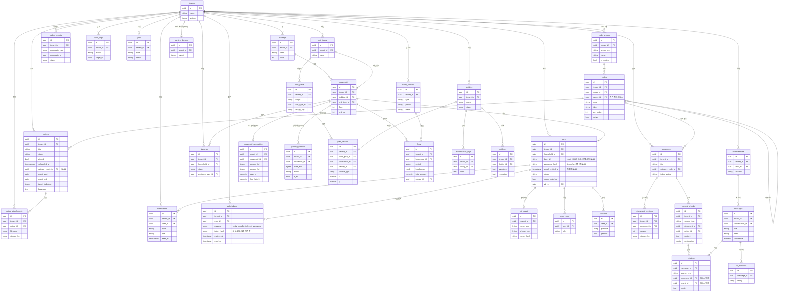

# 03. 데이터베이스 설계서

> 아키텍처: [01-architecture.md](01-architecture.md) · 데이터 아키텍처: [11-data-architecture.md](11-data-architecture.md) · 보안/개인정보: [06-security-privacy.md](06-security-privacy.md)
> 엔진: PostgreSQL 16 + pgvector(HNSW) · ORM: SQLAlchemy 2.0(async) · 마이그레이션: Alembic · 모든 테이블 `snake_case`

## 1. 설계 원칙

1. **멀티테넌시**: 모든 업무 테이블에 `tenant_id`(단지) + **RLS** 강제.
2. **개인정보 분리**: 식별정보는 `pii_vault`에 분리·암호화 저장, 업무 테이블은 참조키만.
3. **불변/감사**: 핵심 행위는 `audit_logs`에 추가-only 기록.
4. **관리비 원천**: 관리자 **엑셀 업로드**가 현재 원천(추후 ERP 어댑터 병행 여지). AI는 **설명만**(계산·부과 금지).
5. **벡터 배치 분리**: 문서·공지 임베딩은 `content_chunks`(pgvector), 시설 텍스트 임베딩은 **Neo4j 벡터 인덱스**에만 — 중복 저장 금지([11-data-architecture.md](11-data-architecture.md)).

## 2. ERD (개념)

> 컬럼은 PK/FK·핵심만 표기(전량 나열 아님). 모든 업무 테이블은 `tenant_id`를 보유하며 RLS로 격리(§5). 시설 그래프·시설 텍스트 벡터는 파생 스토어(Neo4j)로 투영 — [11](11-data-architecture.md).


```mermaid
erDiagram
  tenants ||--o{ buildings : "동"
  tenants ||--o{ unit_types : "타입"
  tenants ||--o{ users : "계정"
  tenants ||--o{ documents : "문서"
  tenants ||--o{ conversations : "대화"
  tenants ||--o{ inquiries : "민원"
  tenants ||--o{ notices : "공지"
  tenants ||--o{ notice_attachments : "첨부"
  tenants ||--o{ facilities : "시설"
  tenants ||--o{ excel_uploads : "업로드"
  tenants ||--o{ outbox_events : "이벤트"
  tenants ||--o{ audit_logs : "감사"
  tenants ||--o{ jobs : "작업"
  tenants ||--o{ notifications : "알림"
  tenants ||--o{ auth_tokens : "토큰"
  tenants ||--o{ code_groups : "코드그룹"
  code_groups ||--o{ codes : "코드"
  codes ||--o{ codes : "하위코드"
  codes ||--o{ notices : "공지분류"
  codes ||--o{ documents : "문서분류"
  buildings ||--o{ households : "세대"
  unit_types ||--o{ households : "타입참조"
  households ||--o| household_geometries : "3D 폴리곤(H9)"
  tenants ||--o| parking_layouts : "주차 배치도(H9-5)"
  households ||--o{ parking_vehicles : "등록 차량(H9-5)"
  unit_types ||--o{ floor_plans : "평면도"
  floor_plans ||--o{ plan_devices : "장치"
  facilities ||--o| plan_devices : "포인트"
  households ||--o{ users : "거주"
  households ||--o{ inquiries : "제기"
  households ||--o{ fees : "관리비"
  users ||--o| pii_vault : "분리저장"
  users ||--o{ user_roles : "역할"
  users ||--o{ consents : "동의"
  users ||--o{ notifications : "수신"
  users ||--o{ auth_tokens : "인증토큰"
  documents ||--o{ document_versions : "첨부버전"
  documents ||--o{ content_chunks : "청크"
  content_chunks ||--o{ citations : "근거"
  conversations ||--o{ messages : "메시지"
  messages ||--o{ citations : "인용"
  messages ||--o{ ai_feedback : "피드백"
  notices ||--o{ notice_attachments : "첨부"
  facilities ||--o{ maintenance_logs : "정비"
  facilities ||--o{ incidents : "장애"
  excel_uploads ||--o{ fees : "적용"

  tenants {
    uuid id PK
    string name
    jsonb settings
  }
  buildings {
    uuid id PK
    uuid tenant_id FK
    string name
    int floors
  }
  households {
    uuid id PK
    uuid tenant_id FK
    uuid building_id FK
    uuid unit_type_id FK
    int floor
    int unit_no
  }
  unit_types {
    uuid id PK
    uuid tenant_id FK
    string name
  }
  household_geometries {
    uuid id PK
    uuid tenant_id FK
    uuid household_id FK
    jsonb polygon_2d
    jsonb polygon_3d
    numeric base_z
    numeric floor_height
  }
  parking_layouts {
    uuid id PK
    uuid tenant_id FK
    jsonb layout
  }
  parking_vehicles {
    uuid id PK
    uuid tenant_id FK
    uuid household_id FK
    bytea plate_enc
    string model
    bool is_ev
  }
  floor_plans {
    uuid id PK
    uuid tenant_id FK
    string scope
    uuid unit_type_id FK
    string image_key
  }
  plan_devices {
    uuid id PK
    uuid tenant_id FK
    uuid floor_plan_id FK
    uuid household_id FK
    uuid facility_id FK
    string device_type
    numeric x
    numeric y
  }
  users {
    uuid id PK
    uuid tenant_id FK
    uuid household_id FK
    string login_id "email HMAC 해시, 초대·시드 NULL"
    string password_hash "Argon2id, 설정 전 NULL"
    timestamp email_verified_at "미검증 NULL"
    string status
    bool roster_matched
    uuid pii_ref FK
  }
  auth_tokens {
    uuid id PK
    uuid tenant_id FK
    uuid user_id FK
    string purpose "verify_email|invite|reset_password"
    string token_hash "SHA-256, 원문 미저장"
    timestamp expires_at
    timestamp used_at
  }
  code_groups {
    uuid id PK
    uuid tenant_id FK
    string group_key
    string name
    bool is_system
  }
  codes {
    uuid id PK
    uuid tenant_id FK
    uuid group_id FK
    uuid parent_id FK "자기참조, NULL"
    string code
    string label
    int sort_order
    bool active
  }
  pii_vault {
    uuid id PK
    uuid tenant_id FK
    bytea name_enc
    bytea phone_enc
    string name_hash
  }
  user_roles {
    uuid id PK
    uuid user_id FK
    string role
  }
  consents {
    uuid id PK
    uuid user_id FK
    string purpose
    bool granted
  }
  documents {
    uuid id PK
    uuid tenant_id FK
    string title
    uuid category_code_id FK
    string index_status
  }
  document_versions {
    uuid id PK
    uuid tenant_id FK
    uuid document_id FK
    int version
    string storage_key
  }
  content_chunks {
    uuid id PK
    uuid tenant_id FK
    string source_type
    uuid document_id FK
    uuid notice_id FK
    text content
    vector embedding
  }
  conversations {
    uuid id PK
    uuid tenant_id FK
    uuid user_id FK
    string channel
  }
  messages {
    uuid id PK
    uuid tenant_id FK
    uuid conversation_id FK
    string role
    string intent
    numeric confidence
  }
  citations {
    uuid id PK
    uuid message_id FK
    string source_kind
    uuid document_id FK "NULL 허용"
    uuid chunk_id FK "NULL 허용"
    text quote
  }
  ai_feedback {
    uuid id PK
    uuid message_id FK
    string rating
  }
  inquiries {
    uuid id PK
    uuid tenant_id FK
    uuid household_id FK
    string status
    uuid assignee_user_id FK
  }
  notices {
    uuid id PK
    uuid tenant_id FK
    string title
    string status
    bool pinned
    timestamptz scheduled_at
    uuid category_code_id FK "NULL"
    date event_start
    date event_end
    jsonb target_buildings
    text keywords
  }
  notice_attachments {
    uuid id PK
    uuid tenant_id FK
    uuid notice_id FK
    string filename
    string storage_key
  }
  notifications {
    uuid id PK
    uuid tenant_id FK
    uuid user_id FK
    string type
    string title
    timestamptz read_at
  }
  facilities {
    uuid id PK
    uuid tenant_id FK
    string name
    string status
  }
  maintenance_logs {
    uuid id PK
    uuid tenant_id FK
    uuid facility_id FK
    text work
  }
  incidents {
    uuid id PK
    uuid tenant_id FK
    uuid facility_id FK
    text symptom
    text resolution
  }
  fees {
    uuid id PK
    uuid tenant_id FK
    uuid household_id FK
    string period
    jsonb breakdown
    numeric total_amount
    uuid upload_id FK
  }
  excel_uploads {
    uuid id PK
    uuid tenant_id FK
    string type
    string period
    string status
  }
  outbox_events {
    uuid id PK
    uuid tenant_id FK
    string aggregate_type
    uuid aggregate_id
    string status
  }
  audit_logs {
    uuid id PK
    uuid tenant_id FK
    string action
    uuid target_id
  }
  jobs {
    uuid id PK
    uuid tenant_id FK
    string type
    string status
  }
```

## 3. 공통 컬럼 규약

모든 업무 테이블: `id (uuid pk)`, `tenant_id (uuid, fk→tenants)`, `created_at`, `updated_at`.

- **금액**: `numeric(12,0)` — KRW **원 단위 정수**(소수 없음). 계산·부과는 원천 데이터, AI는 설명만(§1).
- **시각**: `timestamptz`(UTC 저장), 표시는 `Asia/Seoul`.
- **soft delete**: `deleted_at timestamptz NULL` 적용 테이블 = `documents`·`notices`·`inquiries`·`facilities`·`users`. 이 테이블의 `UNIQUE`는 **partial unique index** `WHERE deleted_at IS NULL`로 걸어 삭제 후 재등록을 허용.
- **updated_at**: DB 트리거로 자동 갱신(앱 누락 방지).
- 개인정보 포함 테이블은 보관기간·파기 정책 적용([06 §4.4](06-security-privacy.md)).

## 4. 핵심 테이블

### 4.1 테넌시·계정

```sql
-- 단지
tenants(id, name, address, status, settings jsonb, created_at, updated_at)

-- 동 (마스터)
buildings(id, tenant_id, name, floors int, created_at, updated_at)
  UNIQUE(tenant_id, name)

-- 세대 (동·층·호로 구조화)
households(id, tenant_id, building_id, floor int, unit_no int,
           unit_type_id NULL,             -- 평면도 타입 참조(unit_types.id, §4.8)
           status, created_at, updated_at)  -- status: active|inactive(공실·사용 중지)
  UNIQUE(tenant_id, building_id, floor, unit_no)
  -- H8-5 설정>동/호수 관리는 위 스키마를 그대로 재사용(마이그레이션 없음). 세대 삭제는
  -- users·inquiries·fees·plan_devices FK 연결 시 앱에서 409로 거부(DB FK가 최종 방어).

-- 사용자 (식별정보는 pii_vault로 분리)
users(id, tenant_id, household_id NULL,
      login_id UNIQUE NULL,          -- email의 keyed HMAC 해시(로그인·중복체크, 전역 유니크). 초대·시드 前, pre_registered 행은 NULL
      password_hash NULL,            -- Argon2id 해시. pre_registered·초대 미완 계정은 NULL(설정 전) — [ADR-0014]
      email_verified_at NULL,        -- 이메일 검증 완료 시각. NULL이면 로그인 차단(FR-ONB-10)
      must_change_password bool,     -- 임시 비밀번호 강제 변경(SYS_ADMIN 부트스트랩, H7-2)
      status,                        -- pre_registered|invited|registered|pending|active|inactive|rejected|withdrawn
                                     --   invited=초대 발송·수락 전(소장·직원, H7-2)
                                     --   registered=가입 완료·프로필 미제출(온보딩 필요 신호, ADR-0014)
                                     --   inactive=전출(1년 보관) · withdrawn=탈퇴(즉시 비식별, [06 §4.4])
      roster_matched bool,           -- 가입 시 명부 사전등록 행과 자동 대조 일치 여부
      pii_ref uuid NULL,             -- pii_vault.id
      approved_by NULL, approved_at NULL, rejected_reason NULL,  -- 소장 승인/거절
      created_at, updated_at)
  -- login_id partial unique index: WHERE login_id IS NOT NULL (기존 인덱스 재사용)

-- 역할 (다대다)
user_roles(id, tenant_id, user_id, role)   -- role: RESIDENT|MANAGER|STAFF|SYS_ADMIN (FACILITY·COUNCIL은 Phase 2)
  UNIQUE(tenant_id, user_id, role)

-- 인증 토큰 (이메일 검증·초대·비밀번호 재설정 — 원문은 URL로만 전달, DB는 해시만, [ADR-0014])
auth_tokens(id, tenant_id, user_id,
            purpose,                 -- verify_email|invite|reset_password
            token_hash,              -- SHA-256(원문 토큰). 원문 미저장
            expires_at,              -- TTL 초기값: verify 24h · invite 7d · reset 1h
            used_at NULL,            -- 사용 시각(1회용 소진 표시)
            created_at)
  INDEX(token_hash)

-- 개인정보 분리 저장 (암호화)
pii_vault(id, tenant_id, name_enc, phone_enc, email_enc, birth_date_enc,
          name_hash, phone_hash,     -- 검색용 해시(평문 저장 금지)
          birth_date_hash,           -- 명부 대조 키(성함+생일+동호) 구성용(H2-1)
          key_version int,           -- 암호화에 쓴 DEK 버전(무중단 키 회전, ADR-0010)
          created_at, updated_at)

-- per-tenant DEK 저장 (KEK(env PII_MASTER_KEY)로 감싼 wrapped key — ADR-0010, H2-1)
tenant_keys(id, tenant_id, key_version int, dek_wrapped bytea,
            created_at)
  UNIQUE(tenant_id, key_version)

-- 개인정보 동의
consents(id, tenant_id, user_id, purpose, granted bool, granted_at, revoked_at,
         policy_version)
```

> **명부 사전등록·온보딩**: 소장이 명부 엑셀(성함·생년월일·동·호)을 일괄 업로드하면 `users` 행이
> 사전 생성된다(`status=pre_registered`, `login_id=NULL`, PII는 `pii_vault`). 입주민이 이메일+비밀번호로 가입하면 별도 행이 `registered`로 생기고,
> 이메일 검증 후 정보 입력 시 사전등록 행과 **자동 대조**(성함+생일+동·호)한다 — 일치 시 **가입자 행을 유지**한 채 `household_id`·`roster_matched=true`를
> 부여하고 사전등록 행은 소진(soft delete)한다(행 이동 없음). 불일치면 가입자 행이 그대로 `pending` 전이. 소장 최종 승인으로 `active`(거절은 `rejected`+사유) — 자동 승격 없음.
> 전체 흐름: [11 §온보딩·명부](11-data-architecture.md).
>
> **명부 재업로드(diff 병합)**: 재업로드 시 기존 `pre_registered` 행과 (성함+생일+동·호) 키로 diff — 신규는 추가, 명부에서 사라진 행은 `inactive`(전출 추정) 표시(자동 삭제 금지, 소장 확인). 이미 `active`로 가입한 세대 계정은 유지.

### 4.2 문서·벡터 (RAG) — H8-2 게시판 전환([ADR-0016](adr/0016-document-board-versioned-attachment.md))

```sql
-- 게시글 메타(관리자 전용 게시판 — 제목+본문(설명용)+첨부 1개 필수)
documents(id, tenant_id, title,
          category_code_id,                          -- FK → codes(tenant_id, id) composite, DOC_CATEGORY 그룹. NOT NULL. RESTRICT — 참조 중 코드 삭제 409. H8-6 전환(← source_type "규약|회의록|공지|지침|매뉴얼", 기존 데이터는 label 일치 매핑 후 컬럼 drop)
          visibility,                                -- ALL|RESIDENT|ADMIN (AI 인용 범위)
          body text NULL,                            -- 본문(설명용 — 임베딩 안 함)
          version int,                               -- 현재 버전 번호(document_versions 최신과 일치)
          index_status,                              -- pending|indexing|indexed|failed
          uploaded_by, created_at, updated_at, deleted_at)

-- 첨부 버전 이력(재업로드 = version+1 + 재인제스트. 이력은 다운로드만 — 롤백 없음)
document_versions(id, tenant_id, document_id,
                  version int, filename, content_type, size_bytes int,
                  storage_key,                       -- {tenant}/documents/{doc_id}/v{n}{suffix}
                  content_hash, uploaded_by, created_at)
  UNIQUE(tenant_id, document_id, version)

-- 청크 + 임베딩 — 소스 다형(문서 + 공지, H8-3 활성)
content_chunks(id, tenant_id,
               source_type,                          -- document|notice
               document_id NULL, notice_id NULL,     -- CHECK: source_type과 정확히 하나 일치
               chunk_index, content text,
               heading, page int, clause,            -- 인용 정확도용 메타
               token_count int,
               embedding vector(1024),               -- bge-m3(1024) 고정
               created_at)
-- 인덱스
--   HNSW(embedding vector_cosine_ops)
--   btree(tenant_id, document_id)
```

> 벡터 검색은 항상 `WHERE tenant_id = $current AND visibility ∈ 허용` 선필터 후 ANN.
> visibility 매핑: `ALL`=인증 사용자 전체 · `RESIDENT`=입주민 · `ADMIN`=MANAGER·STAFF 열람.
> **notice 청크(H8-3)**: visibility 컬럼이 없는 대신 `notices` 조인으로 `status='published' AND deleted_at IS NULL`을 검색 시점에 검증(미발행 미노출 CRITICAL — 인제스트가 published만 대상이어도 이중 방어). 인제스트 대상 = 본문 + 파싱 가능 첨부(.pdf/.txt/.md)만, published 수정·첨부 변경 시 기존 청크 삭제·재임베딩, soft delete 시 청크 즉시 삭제(문서와 동일 패턴).
> 임베딩 모델/차원 변경은 마이그레이션 이벤트(전량 재색인) — 함부로 바꾸지 않음.
> 벡터는 항상 **최신 버전만** — 재업로드 시 기존 청크 삭제·재임베딩(citations.chunk_id SET NULL 보존).
> 중복 방어는 DB 전역 unique 대신 앱 레벨(현재 버전 집합 내 동일 content_hash → 409, ADR-0016).

### 4.3 대화·인용

```sql
conversations(id, tenant_id, user_id, channel,       -- resident|admin
              created_at, updated_at)

messages(id, tenant_id, conversation_id, role,       -- user|assistant|system
         content text, intent,                        -- ai|handoff (1차 분기와 정렬)
         confidence numeric NULL,                      -- 신뢰도
         status,                                       -- answered|fallback|handed_off|clarify(되묻기 — 다음 턴 히스토리·연속 되묻기 차단 근거, [ADR-0025])
         review_status NULL,                           -- needs_review|NULL — 저신뢰 답변 플래그. 검수 큐 제거(H8-7)로 approved/rejected 전이는 없음([ADR-0015] 개정 노트)
         token_input int, token_output int, cost_usd numeric,  -- [08] 비용추적
         created_at)

citations(id, tenant_id, message_id,
          source_kind,                                 -- document_chunk|fee_data|inquiry|facility|graph
          source_ref,                                  -- chunk_id 외 원천 식별자(fee period·facility_id 등)
          source_revision,                             -- 원천 버전(문서 version·관리비 period·upload_id)
          observed_at,                                 -- 근거 관측 시점
          document_id NULL, chunk_id NULL,             -- 문서 인용일 때만(그 외 NULL). chunk_id FK: ON DELETE SET NULL
          quote text, page int, clause)                -- 응답 근거 (실재 검증됨)
```

> **인용은 문서에 한정하지 않는다.** 문서 인용은 `source_kind`의 한 종류일 뿐, 도구 결과(관리비·민원·시설·그래프) 근거도 동일 테이블로 추적한다.
> 신뢰도 임계 미만 응답은 `messages.review_status=needs_review` 플래그 + 사용자에겐 **담당자 연결 폴백**. 사후 검수 컬럼(`reviewed_by`·`reviewed_at`·`review_note`)은 H8-7 마이그레이션 `b2d9e4f7a1c3`이 drop했다(검수 큐 제거 — [ADR-0015](adr/0015-notice-board-replaces-ai-draft.md) 개정 노트).
> **과거 답변 출처 보존**: `chunk_id`는 청크 재색인·삭제 시 `ON DELETE SET NULL`. 원문 청크가 사라져도 `quote`·`source_revision`으로 답변 시점의 근거를 열람할 수 있다.

### 4.4 민원·공지

```sql
-- 민원 분류는 공통 코드 그룹 INQUIRY_CATEGORY(§4.10). inquiry_categories 테이블은 H8-9에서 폐기(ADR-0018).
inquiries(id, tenant_id, household_id, author_user_id,
          category_code_id NULL,                        -- FK → codes (INQUIRY_CATEGORY, RESTRICT), 입주민 선택
          title, body text,
          priority NULL,                                -- urgent|normal|low (담당자 수동 지정, AI 없음)
          status,                                       -- received|assigned|in_progress|done|reopened (완료 건 재접수 — ADR-0018 개정)
          assignee_user_id NULL,
          facility_id NULL,                             -- FK → facilities(tenant_id, id) composite. 담당자가 승인한 정식 연결만(H13-2, FR-FAC-05 ①) — LLM 추천은 후보 제시까지
          attachments jsonb,
          deleted_at NULL,                              -- soft delete(§3)
          created_at, updated_at)

-- 민원 타임라인 (화면 "민원 상세 대화 스레드"의 원천 — 상태·배정·답변/피드백마다 기록, H2-3·H8-9)
inquiry_events(id, tenant_id, inquiry_id, type,        -- created|ai_classified(과거호환)|assigned|status_changed|comment|facility_linked
               actor_user_id NULL,                     -- NULL = 시스템
               payload jsonb,                          -- 상태:{from,to} · 배정:{assignee_user_id} · comment:{kind:reply|feedback, body} · 시설연결:{facility_id, facility_name}
               created_at)

-- 공지 (H8-1 게시판 전환 — AI 초안 폐기, [ADR-0015]. 작성·수정·삭제·고정·임시저장·예약 발행)
notices(id, tenant_id, title, body text, status,       -- draft|scheduled|published
        pinned bool default false,                      -- 상단 고정
        scheduled_at timestamptz NULL,                  -- status=scheduled일 때 발행 예정 시각(ai-worker cron이 도달 시 published 전이+알림)
        published_at, published_by, audience,           -- ALL|building|household
        category_code_id NULL,                          -- FK → codes(tenant_id, id) composite, NOTICE_CATEGORY 그룹. RESTRICT. NULL 허용(임시저장 유연·기존 무분류) — 발행 공지는 분류 권장(강제 아님). H8-6
        event_start date NULL, event_end date NULL,      -- 표시용 행사/작업 기간(게시 노출 제어 아님 — scheduled_at과 무관)
        target_buildings jsonb NULL,                    -- 대상 동 building id 배열. NULL=전체동. 표시용(알림 타게팅은 백로그)
        keywords text NULL,                             -- 콤마 구분 키워드. H8-3 공지 임베딩 텍스트에 포함(본문+키워드)
        deleted_at NULL,                                -- soft delete(§3)
        created_at, updated_at)

-- 공지 첨부 (MinIO 저장, 다운로드는 API 경유 — presigned URL 미사용)
notice_attachments(id, tenant_id, notice_id,           -- FK → notices(tenant_id, id) composite
                   filename, content_type, size_bytes,  -- 확장자 화이트리스트 pdf·hwp·hwpx·docx·xlsx·jpg·jpeg·png, 파일당 20MB, 공지당 최대 5개
                   storage_key,                          -- {tenant_id}/notices/{notice_id}/{attachment_id}
                   created_at)

-- 인앱 알림함 (앱 내 알림만, 외부 자동발송 아님)
notifications(id, tenant_id, user_id, type,            -- notice|inquiry_status|approval|system
              title, body text, link,                  -- link=앱 내 딥링크
              read_at NULL, created_at)                 -- RLS 대상(본인 알림만 열람)
```

> **공지 분류 코드(H8-6)**: `category_code_id`는 같은 tenant·`NOTICE_CATEGORY` 그룹 코드만 허용(앱 검증). FK RESTRICT이라 참조 중 코드 삭제는 DB IntegrityError → API 409(§4.10). NULL 허용이라 임시저장·기존 공지는 무분류로 남을 수 있다. `documents.category_code_id`는 동일 패턴이되 **NOT NULL**(작성 시 DOC_CATEGORY 필수).
>
> **공지 첨부 접근 통제(H8-1 CRITICAL 게이트)**: `notice_attachments`는 `tenant_id` 표준 RLS 대상(§5 일반 규칙 — 예외 테이블 아님). 입주민 다운로드 경로(`GET /notices/{id}/attachments/{att_id}`)는 RLS(tenant) + **공지 published 검증 + 소유 notice 일치**를 앱에서 이중 확인해 교차 tenant·미발행 공지 첨부 접근을 차단한다. 첨부 삭제(`DELETE`)는 행 + MinIO 객체를 함께 제거(하드 삭제 — soft delete 대상 아님).

### 4.5 시설·회의

```sql
facilities(id, tenant_id, name,
           code NULL,                                     -- 시설 코드번호 `EL-401-01`(H14-2) — 등록 시 서버가 부여, 수정 경로 없음
           location, type, status,                        -- normal|check|fault|risk
           next_check_at,
           deleted_at NULL,                               -- soft delete(§3)
           created_at, updated_at)
  UNIQUE(tenant_id, code)                                 -- 단지 안에서만 유일(단지가 다르면 같은 코드 공존 — 규칙 3)

maintenance_logs(id, tenant_id, facility_id, performed_at,
                 work text, performer, parts jsonb, created_at)

incidents(id, tenant_id, facility_id, occurred_at, symptom text,
          resolution text, root_cause text NULL,
          caused_by_incident_id NULL,                     -- 같은 단지 선행 원인 장애(다단계 인과 CAUSED_BY, GraphRAG G1a). composite FK라 타 단지 참조는 DB가 거부
          created_at)
```

> **회의록은 별도 테이블 없이 `documents`(DOC_CATEGORY 코드 "회의록")로 관리**한다.
> 회의 음성 STT·자동 요약은 추후 도입(그때 meetings/meeting_summaries 재설계).

> 단지 배치도·공용층 평면도의 시설 포인트(`plan_devices.facility_id`)는 `facilities`와 nullable FK로 연결한다(§4.8) — 추후 설비 상태맵 확장점.

> **시설 텍스트 임베딩은 PG에 저장하지 않는다.** 장애 증상·조치(`incidents.symptom`/`resolution`) 임베딩은
> Neo4j 노드 벡터 인덱스에만 둔다(중복 금지). Neo4j 노드는 `pg_id`·`tenant_id` 프로퍼티를 보유하며 PG가 SoR·Neo4j는 파생(재생성 가능),
> 모든 Cypher에 `tenant_id` 필터를 강제한다. 그래프 모델·동기화: [11-data-architecture.md](11-data-architecture.md).

### 4.6 관리비 (엑셀 업로드 원천, 추후 ERP 병행)

```sql
-- 관리자 엑셀 업로드가 원천. AI는 설명만(계산 X). 재업로드 = 해당 (tenant, period) 전 행 삭제 후 삽입(단일 트랜잭션, 전체 교체).
fees(id, tenant_id, household_id, period,            -- YYYY-MM
     breakdown jsonb,                                 -- 항목별 금액 {일반관리비, 청소비, 난방, ...}
     total_amount numeric,
     source,                                          -- excel | erp(추후)
     upload_id NULL,                                  -- excel_uploads.id
     created_at)
  UNIQUE(tenant_id, household_id, period)

-- 엑셀 업로드 이력 (관리비·명부 공통)
excel_uploads(id, tenant_id, type,                    -- fee | roster
              period NULL,                            -- fee일 때 YYYY-MM
              file_key, status,                       -- uploaded|validated|applied|failed
              row_count int, error_report jsonb,      -- 행 단위 검증 오류(세대 불일치 등)
              uploaded_by, created_at)
```

> 업로드 플로우: 업로드 → 파싱·Pydantic 검증 → 오류 리포트/미리보기 → 확정 적용. 확정 적용은 **해당 `(tenant_id, period)`의 기존 `fees` 전 행 삭제 후 재삽입**(단일 트랜잭션 = docs/11의 "전체 교체"). 상세: [11 §관리비 엑셀 업로드](11-data-architecture.md).

### 4.7 운영·AI 품질·작업

```sql
audit_logs(id, tenant_id, actor_user_id, action, target_type, target_id,
           meta jsonb, ip, created_at)                      -- append-only

ai_feedback(id, tenant_id, message_id, rating,             -- up|down
            reason text NULL, created_at)

ai_eval_golden(id, tenant_id NULL, question text,          -- NULL=공용 골든셋
               expected_answer text, expected_doc_id NULL,
               tags jsonb, created_at)

jobs(id, tenant_id, type,                                   -- ingest|ocr|reembed|eval
     ref_id, status, attempts int, error text NULL,
     created_at, updated_at)

ai_backend_config(id int PK CHECK (id = 1),                 -- 전역 단일 행 (H15-1·H15-3)
                  base_url text, model text,
                  api_key text NULL,                        -- 응답에는 항상 마스킹
                  reasoning_effort text NULL,
                  -- H15-3: 임베딩(위험 노브 — 변경 후 재색인 필수, 차원은 1024 고정)
                  embedding_base_url text NULL, embedding_model text NULL,
                  embedding_api_key text NULL,
                  -- H15-3: 튜닝 노브(NULL = env/코드 기본값 폴백)
                  chunk_max_tokens int NULL,                -- 재색인 필요(위험)
                  retrieval_top_k int NULL,
                  llm_max_output_tokens int NULL, llm_timeout_s float NULL,
                  tool_confidence float NULL, answer_cache_ttl_s int NULL,
                  updated_at)
```

> **`ai_backend_config`(H15-1·H15-3)**: LLM 생성·임베딩 백엔드와 RAG 튜닝 노브의 런타임 전환용 전역 설정. 테넌트 데이터가 아니므로 `tenant_id`·RLS 없음. NULL 컬럼은 env/코드 기본값 폴백(행 없음 = 전부 env, 기존 계약 유지). api_key류는 SYS_ADMIN이 UI로 입력하며 응답에는 끝 4자만 노출. **읽기 롤**: api(`liviq_app`)는 R/W, ai-worker(`liviq_worker`)는 SELECT만 — 인제스트(청킹·임베딩)가 활성 설정을 따르기 위함.
> **위험 노브 규율(H15-3)**: `embedding_*`·`chunk_max_tokens` 변경은 기존 벡터 색인과 불일치를 낳는다 — UI가 저장 시 경고하고, 반영은 **명시적 재색인 트리거**(전 문서·공지 재인제스트 enqueue)로 완성한다. 임베딩 차원은 스키마 `Vector(1024)` 고정 — 연결 테스트가 실제 임베딩 호출로 차원을 실측해 1024가 아니면 저장을 거부한다(차원 변경은 스키마 마이그레이션 = UI 밖).

> **`audit_logs` append-only 강제**: 런타임 DB role에 `INSERT`·`SELECT`만 `GRANT`, `UPDATE`·`DELETE`는 `REVOKE`(RLS와 동일한 Alembic custom migration 게이트에서 설정). 앱 코드 규율이 아니라 **권한으로 수정·삭제 차단**.

### 4.8 평면도·디지털트윈

> **H13-3에서 기동**(2026-07-27 인터뷰 확정 — apt-facility-finder 프로토타입 포팅). 세대 내부 2D 평면도
> (`unit_types`·`floor_plans`·`plan_devices`)는 초기 스키마(`d5422d3f35d5`)에 실존했으나 H13-3 이전까지
> **3개 모두 0행**이었고, api·ai-worker 코드 참조도 `unit_types` 0 · `floor_plans` 0 · `plan_devices` 2
> (H8-5 세대 삭제 보호의 링크 체크뿐)에 그쳤다(2026-07-26 실측). 경위: 단지 트윈은 H9에서
> **`household_geometries` 기반 3D**로 갔고([ADR-0019](adr/0019-complex-twin-3d.md)), H9-6은 `unit_types`
> 마스터+FK CRUD를 만들었다가 **과설계로 폐기**해 트윈 라벨 표시 전용으로 축소했다
> ([09 §8.11](09-implementation-harness.md)). 당시 **테이블은 남겨졌다**(drop 마이그레이션이 `plan_devices`
> 참조 코드까지 손대는 비용·되돌리기 비용보다 이득이 작다는 판단 — 입주민 평면도 기능을 살릴 때 재사용
> 전제) — H13-3이 그 재사용이다. **신규 ADR 없음** — 아래는 기존 §4.8 계약의 기동이며
> [ADR-0022](adr/0022-facility-graph-dashboard.md)가 범위를 커버한다. 구현된 트윈은 이 절 뒤쪽의
> `household_geometries`다 — 세대 내부 2D 평면도와는 **별개 표면**(단지 외형 3D).

배경 이미지(스캔 원본) + 좌표 레이어 방식(CAD 벡터화 아님). 마커는 정적 데이터(IoT 미연동, 추후 확장 여지).

```sql
-- 평면도 타입 (예: 84A)
unit_types(id, tenant_id, name, description, created_at, updated_at)

-- 평면도 (세대타입 / 동 공용층 / 단지 배치도 공통)
floor_plans(id, tenant_id, scope,               -- unit_type|building_common|site
            unit_type_id NULL, building_id NULL, floor_label NULL,
            image_key, image_width int, image_height int,   -- 원본 픽셀 크기
            version, created_at, updated_at)

-- 장치/포인트 (타입 기본 + 세대 오버라이드 단일 테이블)
plan_devices(id, tenant_id, floor_plan_id,
             household_id NULL,      -- NULL=타입 기본, 값=해당 세대 오버라이드
             base_device_id NULL,    -- move/hide 대상 기본 장치
             action,                 -- base|add|move|hide (H13-3은 base만 기동 — 아래 오버라이드 문단)
             device_type,            -- entrance_door|room_door|window|outlet|breaker_box|router|facility_point|room|…
             x numeric, y numeric,   -- 배경 이미지 픽셀 좌표
             room NULL,              -- 방 이름(H13-3 신규) — "안방 콘센트" 같은 방 축 질의용
             dir NULL,                -- 벽 방향 up|down|left|right(H13-3 신규), NULL=원형 마커
             label, memo, photo_key NULL,
             facility_id NULL,       -- scope=site/building_common일 때 facilities 연결(nullable FK)
             created_at, updated_at)
```

**세대 오버라이드는 스키마 보유·H13 미구현**: `action`은 `base|add|move|hide` 4값을 스키마상 보유하지만
H13-3은 **`action='base'`·`household_id=NULL`만** 적재·조회한다(타입 기본 장치 공통 노출, 세대별 add/move/hide
없음). 아래 렌더 규칙은 오버라이드를 구현할 때의 **향후 계약**으로 존치한다.

**렌더 규칙**(향후 계약 — H13-3 범위는 `base`뿐): 세대 평면도 = 타입 `base` 장치 − 세대 `hide` − 세대 `move`(대체) + 세대 `add`. 좌표계는 원본 이미지 픽셀, 프론트는 viewBox 스케일링.

**방 중심좌표**: 신규 테이블 없음 — `plan_devices`에 `device_type='room'` 행으로 표현한다(`x`/`y`=방 중심 좌표,
`room`=해당 방 이름). 자연어 위치 질의(H13-5)는 이 행과 일반 장치 행의 `room` 컬럼을 같은 방식으로 필터한다.

**`unit_types` ↔ `household_geometries.unit_type_label`**: 두 표면이 평형을 각자 표시한다 — `unit_types`는
H13-3 평면도 마스터 라벨(예: `84M`), `household_geometries.unit_type_label`은 H9 트윈 `units.json` 업로드
원본 라벨(예: `84M(공공임대)`, 표시용 — unit_types 마스터와 무관, §4.8 도입부 원문 그대로). 세대→평면도 매칭은
**라벨 정규화 매칭**(괄호 이하 등 부가 표기 제거 후 비교, 예: `84M(공공임대)`→`84M`)으로 세대의
`unit_type_label`에서 `unit_types.name`을 찾는다 — 두 테이블 간 FK는 두지 않는다(업로드 원본 라벨이 자유
형식이라 강제 매칭 불가, 정규화 실패 시 해당 세대는 평면도 없음으로 처리).

**접근 통제**: 입주민은 **본인 세대**의 `floor_plans`/`plan_devices`만 열람. 타 세대 평면도 접근 절대 불가 — **RLS는 tenant 경계까지만 보장**하고, 본인 세대 한정은 **앱 소유권 검증**(`household_id` 일치)으로 강제한다([06]). 단지 배치도·공용층은 인증 입주민 공통 열람.

**단지 3D 트윈 geometry** (H9 · [ADR-0019](adr/0019-complex-twin-3d.md)) — **여기부터가 구현된 부분이다**.
위 세대 내부 2D 평면도와 별개 표면(단지 외형 3D):

```sql
-- 세대 3D 폴리곤 (units.json 업로드 산물 — 렌더 전용, PostGIS 미도입)
household_geometries(id, tenant_id,
                     household_id,           -- FK → households(tenant_id, id) composite
                     polygon_2d jsonb,       -- [[lon,lat] × n]
                     polygon_3d jsonb,       -- [[lon,lat,z] × n] — 렌더 정본(업로드 산물 그대로, 재계산 없음)
                     base_z numeric, floor_height numeric,
                     area_m2 numeric NULL, unit_type_label text NULL,  -- 표시용(unit_types 마스터와 무관한 원본 라벨)
                     created_at, updated_at)
  UNIQUE(tenant_id, household_id)
```

> **적재 계약**: `POST /admin/twin/geometry`가 `units.json`의 unit을 (동명→`buildings.name`, `floor`, `ho`→`households.unit_no`)로
> 매칭해 적재 — matched만 반영·unmatched는 검증 리포트로 반환, **재업로드=tenant 전체 교체**(단일 트랜잭션).
> geometry 생성 파이프라인(shapefile→units.json)은 LIVIQ 밖(외부 도구) — LIVIQ는 이 계약만 소유한다.
> soft delete 대상 아님(§3 목록 제외 — 교체 업로드가 수명주기). RLS는 표준 tenant 격리(§5 일반 규칙).
> 세대원·입주 상태는 이 테이블이 아니라 **기존 명부(`users`)·`households`가 원천**([ADR-0019](adr/0019-complex-twin-3d.md) — 신규 명부 테이블 없음).

### 4.9 outbox (PG→Neo4j 동기화)

```sql
outbox_events(id, tenant_id, aggregate_type,          -- facility|incident|maintenance_log|floor_plan(H13-6 — 도면+마커 전체 스냅샷. 마커는 delete-then-insert 전체 교체(§4.8)라 개별 plan_device 이벤트 대신 도면 단위 스냅샷 1건으로 투영)
              aggregate_id, event_type,               -- created|updated|deleted
              sequence bigint,                        -- aggregate별 단조 증가(순서 보장)
              dedupe_key UNIQUE,                      -- 중복 이벤트 차단
              payload jsonb, status,                  -- pending|processed|failed
              attempts int, created_at, processed_at NULL)
```

> 시설 도메인 쓰기 트랜잭션에서 도메인 행과 `outbox_events`를 **원자적으로** 기록 → `ai-worker`가 순차 반영(MERGE). Neo4j는 파생·재생성 가능(전체 리플레이로 재구성). 상세 흐름: [11 §PG→Neo4j 동기화](11-data-architecture.md).
> **워커 처리 규칙**: `FOR UPDATE SKIP LOCKED`로 이벤트 claim(중복 처리 방지). Neo4j 노드에 `last_applied_version`을 저장해 더 오래된 이벤트는 거부(순서 역전 방지). delete는 노드 삭제가 아니라 **tombstone 이벤트**로 처리(지연 도착한 update가 삭제된 노드를 재생성하지 못하게). 최대 재시도 초과 시 **DLQ**(`status=failed`)로 격리 후 운영자가 재처리.
> **DLQ 정책**: `payload`는 aggregate **전체 스냅샷**. 한 이벤트가 DLQ로 격리돼도 **후속 이벤트 처리는 계속 진행**하며, DLQ 재처리는 중간 이벤트를 순차 재생하지 않고 **최신 스냅샷 리플레이**로 수렴시킨다.

### 4.10 공통 코드 레지스트리 (H8-4 · [ADR-0017](adr/0017-tenant-code-registry.md))

분류를 하드코딩하지 않고 tenant 스코프 계층 코드로 관리한다. 공지 분류(NOTICE_CATEGORY)·문서 카테고리(DOC_CATEGORY)가 첫 소비처 — H8-6에서 `notices.category_code_id`(NULL 허용)·`documents.category_code_id`(NOT NULL)가 FK **RESTRICT**로 참조 전환됐다(적용됨).

```sql
-- 코드 그룹 (예: NOTICE_CATEGORY | DOC_CATEGORY)
code_groups(id, tenant_id, group_key,          -- 그룹 식별 키(대문자 스네이크)
            name, description text NULL,
            is_system bool default false,      -- 시스템 그룹: 삭제·group_key 변경 불가(코드 행 자체는 수정·추가·비활성 가능)
            created_at, updated_at)
  UNIQUE(tenant_id, group_key)

-- 코드 (계층 — parent_id 자기참조)
codes(id, tenant_id, group_id,                 -- FK → code_groups(tenant_id, id) composite
      parent_id NULL,                          -- FK → codes(tenant_id, id) composite, 계층(하이라키)
      code, label, sort_order int default 0,
      active bool default true,
      created_at, updated_at)
  UNIQUE(tenant_id, group_id, code)
```

> **RLS**: 두 테이블 모두 표준 tenant 격리(§5 일반 규칙 — 예외 아님). cross-tenant 참조는 composite FK로 차단.
> **계층**: `parent_id` 자기참조. UI는 2단계까지 권장, DB는 깊이 제한 없음 — **순환 방지는 앱 검증**(`PATCH /admin/codes` parent_id 변경 시).
> **삭제 정책**: soft delete 대상 **아님**(§3 목록 제외) — **하드 삭제**. is_system 그룹 삭제는 409, 삭제 시 하위 코드 CASCADE. 도메인 테이블(`notices`·`documents`)이 H8-6에서 `codes.id`를 FK **RESTRICT**로 참조하게 됐다(적용됨) → 참조 중 코드 삭제는 DB IntegrityError → API 409, 비활성(`active=false`)으로 숨김 권장.
> **기본 코드 시드**(규칙 8 — 액션은 코드): 단지 생성 시 시드 + 기존 단지는 마이그레이션 시드. NOTICE_CATEGORY(일반·시설점검·방역소독·회의결과·주민행사·시스템장애 — '일반' 기본), DOC_CATEGORY(규약·회의록·공지·지침·매뉴얼). 그룹은 `is_system=true`(삭제·키 변경 잠금), 코드 행은 단지별 수정·추가·비활성 가능.

### 4.11 주차장 (H9-5 — 지하주차장 배치도·등록 차량 · H16 — 점유 영속화)

관리자 주차장 대시보드·입주민 최근접 빈자리 도구(`find_nearest_available_parking` — H15-4, 점유 조회는 H16 컬럼으로 재배선)의 원천. **면 점유 상태도 DB가 단일 출처다**(H16) — H9-5의 프론트 시뮬레이션을 폐기하고, 시드가 배정한 주차면·입차시각을 `parking_vehicles`에 저장한다(번호판 인식 카메라 연동 시 시드 경로만 교체 — [11 §3.4.2](11-data-architecture.md)). 별도 `parking_occupancy` 테이블(H15-4 초안)은 H16 컬럼 방식으로 대체·폐기했다([ADR-0023](adr/0023-parking-occupancy-persisted.md) 개정 노트).

```sql
-- 지하주차장 배치도 (단지당 1행 · 전량 교체 · 렌더 페이로드 그대로)
parking_layouts(id, tenant_id,
                layout jsonb,            -- viewBox · buildings(동명→footprint 맵) · boxes(진입 램프·기계전기실)
                                         -- · cores · spots[{no, kind(일반|장애인|전기차), x, y, dir}]
                created_at, updated_at)
  UNIQUE(tenant_id)

-- 차량 1대 (세대당 다건 허용 — UNIQUE 없음). H16: 외부 차량은 household_id NULL.
parking_vehicles(id, tenant_id,
                 household_id NULL,      -- FK → households(tenant_id, id) composite, ON DELETE CASCADE
                                         -- NULL = 외부 차량(명부에 없는 방문·방치 차량 — H16)
                 plate_enc bytea,        -- 차량번호 봉투 암호화(AES-256-GCM · per-tenant DEK) — 평문 컬럼 없음
                 model text NULL,        -- 차종(표시용)
                 is_ev bool default false,
                 spot_no text NULL,      -- 주차면 번호(layout spots.no) — NULL = 등록만 되고 미주차(H16)
                 entry_at timestamptz NULL, -- 입차시각(경과 시간 표시 근거) — spot_no와 함께만 의미(H16)
                 created_at, updated_at)
  INDEX(household_id), INDEX(tenant_id, household_id),
  UNIQUE(tenant_id, spot_no) WHERE spot_no IS NOT NULL   -- 한 면에 두 대 금지(부분 유니크)
```

> **적재 계약**: API는 **읽기 전용**(`GET /admin/parking/layout`·`GET /admin/parking/vehicles`, MANAGER) — 적재는 시드 스크립트(`apps/api/scripts/seed_parking.py` + `scripts/data/parking_layout.json`·`parking_vehicles.json`)가 담당한다. 배치도는 전량 교체, 차량은 delete-then-insert(멱등)이며 차량 (동, 호)를 `buildings.name`·`households.unit_no`로 매칭 — 미매칭은 스킵하고 리포트에 표본을 남긴다(트윈 geometry 업로드와 동일 규율).
> **점유 배정(H16)**: 시드가 결정적 난수(고정 시드)로 배정한다 — 입주민 차량 재실률 0.75·자기 동 코어 근처 선호·장애인면 미배정·전기차면 EV 전용, 외부 차량 8대는 입구 근처 선호에 절반은 장기(20~72h). 규칙은 폐기한 프론트 시뮬(parking-sim)과 동일하되 Python 재구현이라 배치 결과의 비트 일치는 요구하지 않는다(재실행 멱등이면 충분).
> **파일럿 실적재**(첫마을 4단지): 442면(일반 406·장애인 15·전기차 21)·차량 348대(274세대·EV 29) 전량 매칭(미매칭 0).
> **차량번호는 PII**: `pii_vault`가 아니라 세대 귀속 업무 테이블에 암호문으로 두고, 복호는 관리자 조회 API만 수행한다(마스킹 없이 전량 표시 — 주차 관리 목적, 입주민 앱·LLM 미노출, [06 §4.1](06-security-privacy.md)).
> soft delete 대상 아님(§3 목록 제외 — 교체 적재가 수명주기). RLS는 두 테이블 모두 표준 tenant 격리(§5 일반 규칙 — ENABLE+FORCE·`tenant_isolation`). 최근접 빈자리 도구는 api 프로세스(`liviq_app`)에서 `parking_vehicles.spot_no`를 SELECT한다.

## 5. RLS (행 수준 보안)

```sql
-- 모든 업무 테이블에 적용 (예: documents)
ALTER TABLE documents ENABLE ROW LEVEL SECURITY;
ALTER TABLE documents FORCE ROW LEVEL SECURITY;   -- owner도 우회 불가
CREATE POLICY tenant_isolation ON documents
  FOR ALL
  USING (tenant_id = nullif(current_setting('app.tenant_id', true), '')::uuid)
  WITH CHECK (tenant_id = nullif(current_setting('app.tenant_id', true), '')::uuid);
```
- API는 트랜잭션 시작 시 `SET LOCAL app.tenant_id = $`, `app.user_id`, `app.role` 설정.
- **마이그레이션 owner와 런타임 role 분리**: 런타임 role에 `BYPASSRLS` 부여 금지(테이블 owner는 기본 RLS를 우회하므로 `FORCE`로 차단). 정책·role은 스키마 자동생성 대상이 아니므로 **Alembic custom migration(`op.execute`)으로 버전관리**([09 §2.1](09-implementation-harness.md)). 접속 계약은 아래 §5.1.
- **트랜잭션 래퍼 강제**: 모든 쿼리는 tenant 컨텍스트가 설정된 트랜잭션 래퍼 안에서만 실행 — 래퍼 밖 쿼리는 구조적으로 금지.
- **composite FK로 cross-tenant 참조 차단**: 부모 `UNIQUE(tenant_id, id)` + 자식 `FK(tenant_id, parent_id) → 부모(tenant_id, id)`로 다른 단지 행 참조를 DB가 거부.
- **컨텍스트 미설정 시 fail-closed**: `app.tenant_id` 미설정이면 `nullif(...)`가 NULL → 정책이 거짓 → 읽기·쓰기 **모두 실패**.
- `SYS_ADMIN`은 단지 업무 데이터 RLS를 우회하지 **않는다**(메타/모니터링 테이블만 접근). 단지 콘텐츠 열람은 별도 승인·감사 필요([06 §3](06-security-privacy.md)).
- 애플리케이션 레벨 필터 + DB 레벨 RLS **이중 방어**.
- **워커(ai-worker) role 정책**: `ai-worker` 전용 DB role은 `outbox_events`·`jobs`에 한해 **cross-tenant `SELECT`/`UPDATE`** 허용(큐 폴링·claim). 도메인 테이블 접근 권한은 없다 — 이벤트를 claim한 뒤 그 이벤트의 `tenant_id`로 `SET LOCAL app.tenant_id` 후 도메인 반영. 큐만 전역, 도메인은 tenant 컨텍스트로 **`BYPASSRLS` 없이** 처리. **예외(H8-1 예약 발행, [ADR-0015](adr/0015-notice-board-replaces-ai-draft.md))**: `notices`에 `worker_scheduled_scan` 정책(SELECT 한정, `status='scheduled' AND deleted_at IS NULL` 행만 — 발행 전 운영자 작성물, PII 없음)으로 cross-tenant 스캔 허용. 발행 전이(`UPDATE notices`)·알림 생성(`SELECT users`·`INSERT notifications`)은 표준 tenant 격리를 그대로 받아 해당 tenant `SET LOCAL` 후에만 성립. **공지 인제스트(H8-3)**: 워커가 tenant 컨텍스트에서 `notice_attachments` **SELECT**(첨부 파싱용, H8-3 GRANT 추가)와 `content_chunks` 쓰기(H8-2 GRANT 기존)를 수행.

**전역·예외 테이블 정책** — 아래 테이블은 표준 tenant 격리에서 예외:

| 테이블 | 정책 |
|--------|------|
| `ai_eval_golden` | `tenant_id = current OR tenant_id IS NULL` — 공용 골든셋(NULL) + 자기 단지 골든셋 읽기 |
| `tenants` | RLS 예외 — 멤버십(사용자↔테넌트) 기반 인가로 접근 통제 |
| `outbox_events`·`jobs` | 워커 role만 cross-tenant(위), 그 외 role은 표준 tenant 격리 |
| `notices` (예약 발행 스캔 한정) | 워커 role만 `worker_scheduled_scan` **SELECT**(scheduled·미삭제 행만 — H8-1, 위) — 그 외 role·연산은 표준 tenant 격리 |
| `users` (auth 조회 한정) | **`auth_lookup` permissive 정책(H2-1)** — 로그인·이메일 중복체크의 `login_id`(email HMAC) 전역 조회는 tenant 확정 전이라 표준 격리를 못 통과. `SET LOCAL app.auth_lookup='on'` 플래그가 켜진 트랜잭션에서 **SELECT만** 허용(`USING (current_setting('app.auth_lookup', true) = 'on')`). 로그인·가입 조회 경로만 사용, 쓰기는 불가 — 행을 찾으면 그 `tenant_id`로 정상 컨텍스트 재설정 후 진행 |
| `auth_tokens` (검증 한정) | 초대·검증·재설정 링크는 tenant 확정 전 `token_hash`로 전역 조회 — `users` auth 조회와 동일하게 `auth_lookup` 플래그 트랜잭션에서 **SELECT만** 허용, 소진(`used_at`) 쓰기는 정상 tenant 컨텍스트에서 |

### 5.1 접속 롤 계약 (H10-2)

**정책이 걸려 있는 것과 런타임이 그 정책을 받는 것은 별개다.** `ENABLE`+`FORCE`가 적용돼 있어도 접속 롤이
`BYPASSRLS`(또는 superuser)면 정책은 무조건 통과한다 — H10-1 스모크에서 실제로 그 상태였다([09 §8.13](09-implementation-harness.md)).
따라서 **어떤 롤로 접속하는지가 이중 방어 2층의 성립 조건**이다.

| 프로세스 | 접속 롤 | 왜 |
|---|---|---|
| Alembic 마이그레이션 (`migrate`) | **owner**(`liviq` — DDL·정책·GRANT 소유) | 스키마 변경 권한이 필요. 런타임 롤엔 DDL 권한 없음 |
| `apps/api` | **`liviq_app`** | 표준 tenant 격리 정책 대상. `tenants` 외 업무 테이블 DML |
| `apps/ai-worker` | **`liviq_worker`** | `worker_queue_access`·`worker_scheduled_scan` 정책의 `TO` 대상 — 큐만 cross-tenant |
| 시드·일회성 운영 스크립트 | **owner** | 공용 골든셋(`tenant_id IS NULL`)·코드 시드 등 컨텍스트 밖 쓰기가 목적. 워크스테이션에서 수동 실행 |
| 테스트(`packages/db`·`apps/api`) | owner 접속 + `SET LOCAL ROLE` | 한 커넥션으로 두 런타임 롤을 모두 검증(픽스처 단순화). **실접속 롤 세션 테스트를 별도로 둔다** — `SET ROLE` 경로만 검증하면 배선 회귀를 못 잡는다 |

- **`liviq_app`·`liviq_worker`는 LOGIN 롤이 된다.** 생성 시엔 `NOLOGIN`(마이그레이션 `eaf86de665b0`)이고,
  비밀번호는 **마이그레이션에 두지 않는다**(VCS 시크릿 금지). env(`APP_DATABASE_URL`·`WORKER_DATABASE_URL`)가
  비밀번호의 **단일 출처**이고, 배포의 `migrate` 스텝이 그 URL에서 파싱해 `ALTER ROLE … LOGIN PASSWORD`로
  **수렴**시킨다(멱등 — 매 배포 재실행 = 비밀번호 회전 자동 반영).
- **fail-closed 검증**: 같은 스텝이 각 런타임 롤에 대해 ① `rolsuper`·`rolbypassrls`가 아님 ② tenant 컨텍스트
  없이 업무 테이블 조회가 **0행**임을 확인하고, 어긋나면 **배포를 중단**한다. env를 owner URL로 되돌리는
  회귀(= H10-1에서 발견된 그 상태)를 배포 시점에 잡는 유일한 지점이다.
- **GRANT 누락은 런타임 500이다.** owner 접속에선 드러나지 않으므로, 새 테이블을 만드는 마이그레이션은
  **같은 리비전에서 `liviq_app`(필요 시 `liviq_worker`) GRANT를 함께** 준다. 테이블별 권한 폭은 업무 규율을
  권한으로 굳히는 수단이다 — `audit_logs`·`inquiry_events`·`tenant_keys`는 append-only(SELECT·INSERT만),
  `ai_eval_golden`은 읽기만, `tenants`는 SELECT·INSERT·UPDATE·DELETE(단지 생성·상태 전환·빈 단지 삭제 — SYS_ADMIN 업무. 계정이 있는 단지 삭제는 라우터가 409로 막는다).

## 6. 개인정보 처리

| 항목 | 정책 |
|------|------|
| 저장 | 이름·연락처·이메일·생년월일은 `pii_vault`에 **봉투 암호화(AES-256-GCM)** — env 마스터 키(KEK) + per-tenant DEK, 다단지 확장 시 KMS 승격. 복호화는 전용 앱 서비스만([06 §4.1](06-security-privacy.md)). 업무 테이블은 `pii_ref`만 |
| 검색 | 평문 대신 정규화 후 **keyed HMAC** 해시로 조회(단순 salted hash는 값 공간 작은 전화번호·생년월일에 사전 대입 취약). HMAC 키는 별도 env 없이 **KEK(`PII_MASTER_KEY`)에서 HKDF로 파생**(`info="pii-hmac"`) — 키 공급원 1개 유지(H2-1) |
| 표시 | 입주민 노출 화면은 마스킹 표시 (예: `홍*동`, `010-****-1234`) — 복호화·마스킹은 전용 앱 서비스가 수행 |
| LLM 전송 | 호출 전 마스킹/가명화. 원문 식별정보 전송 0건 ([06], FR-AI-05) |
| 보관 | 동의 목적·기간 만료 시 파기 배치. 탈퇴 시 즉시 비식별/삭제 |
| 로그 | `audit_logs`·앱 로그에도 개인정보 비저장(마스킹) |

**차량번호(H9-5)**는 `pii_vault`가 아니라 `parking_vehicles.plate_enc`에 같은 봉투 암호화(per-tenant DEK)로 저장한다 — 세대 귀속 업무 데이터이고 검색 해시가 필요 없다. 복호는 관리자(MANAGER) 주차장 조회 API만 수행하며, **마스킹 없이 전량 표시**(주차 관리 목적 — 입주민 앱·LLM 경로에는 노출하지 않는다, [06 §4.1](06-security-privacy.md)).

**DB 뷰는 복호화하지 않는다** — 복호화·마스킹(`홍*동`)은 복호화 권한을 가진 전용 애플리케이션 서비스만 수행([06 §4.1](06-security-privacy.md)). DB 뷰는 비식별 컬럼 + 검색 해시·상태 배지만 노출한다:
```sql
CREATE VIEW v_users_safe AS
SELECT u.id, u.tenant_id, u.household_id, u.status, u.roster_matched,
       p.name_hash, p.phone_hash        -- 조회·대조용 해시(평문·복호화 없음)
FROM users u LEFT JOIN pii_vault p ON p.id = u.pii_ref;
```

## 7. 인덱싱·성능

- 벡터: `content_chunks` HNSW (cosine). 검색 전 `tenant_id`·`visibility` 선필터.
- 빈번 조회: `inquiries(tenant_id, status)`, `notices(tenant_id, status, published_at)`(목록 정렬은 `pinned DESC, published_at DESC`), `notice_attachments(tenant_id, notice_id)`, `fees(tenant_id, household_id, period)`, `messages(conversation_id, created_at)`, `plan_devices(tenant_id, floor_plan_id)`, `plan_devices(tenant_id, household_id)`, `codes(tenant_id, group_id, sort_order)`(코드 트리 정렬 조회), `notices(tenant_id, category_code_id)`·`documents(tenant_id, category_code_id)`(분류 필터 조회 — H8-6).
- 동기화 큐: `outbox_events(status, created_at)` — `ai-worker` 폴링용.
- 트윈 geometry: `household_geometries UNIQUE(tenant_id, household_id)`가 조회를 커버(전량 로드 1쿼리 — 추가 인덱스 불요, H9).
- 주차: 배치도는 `parking_layouts UNIQUE(tenant_id)`로 단지 1행 조회, 차량은 `parking_vehicles(tenant_id, household_id)`(명부 조인 전량 로드 1쿼리, H9-5).
- `audit_logs`·`messages`는 월 단위 파티셔닝 고려(증가 대비).
- N+1 방지: 목록은 조인/배치 로드.

## 8. 마이그레이션 전략

- Alembic 마이그레이션을 버전관리(RLS 정책·role은 custom migration `op.execute`, [09 §2.1](09-implementation-harness.md)). 운영 반영은 CI에서 자동 실행([09]).
- 파괴적 변경(컬럼 삭제·임베딩 차원 변경)은 2단계(추가→백필→정리)로 무중단.
- **시드 분리**:
  - **운영 시드**: 역할·민원 카테고리·공용 골든셋 + 파일럿 단지 90세대 마스터(`buildings`·`households`·`unit_types`) + **최초 SYS_ADMIN 부트스트랩**(설치 스크립트가 시스템 테넌트(고정 UUID) 계정 생성 — 임시 비밀번호 출력, 첫 로그인 시 변경 강제). 소장·직원은 시드 자동 부여 아닌 **초대 토큰**(`auth_tokens` purpose=`invite`)으로 등록([06 §2](06-security-privacy.md), [ADR-0014](adr/0014-local-email-auth.md)).
  - **테스트 픽스처**: 2-tenant 합성 데이터 + 90세대 생성기(격리·소유권 테스트용). 운영 시드와 코드 경로 분리.
