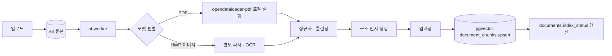
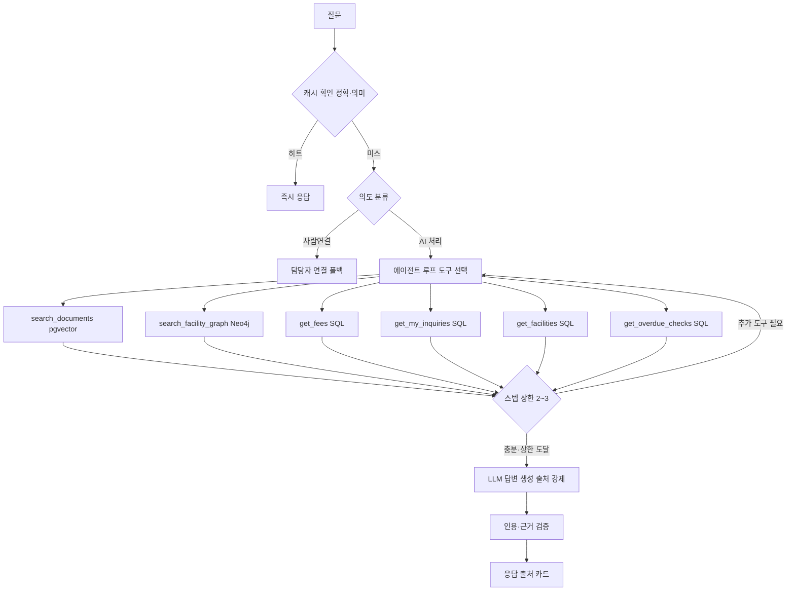
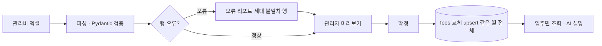
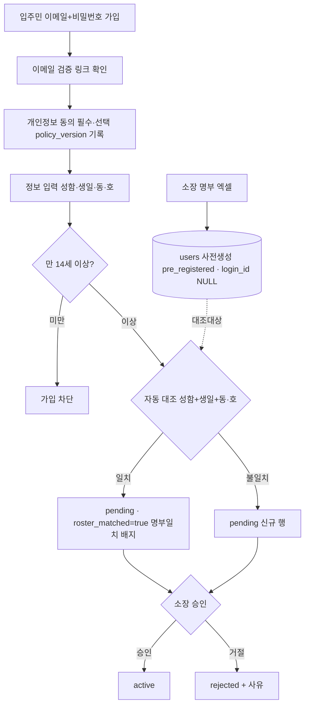
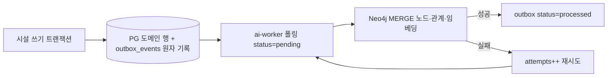
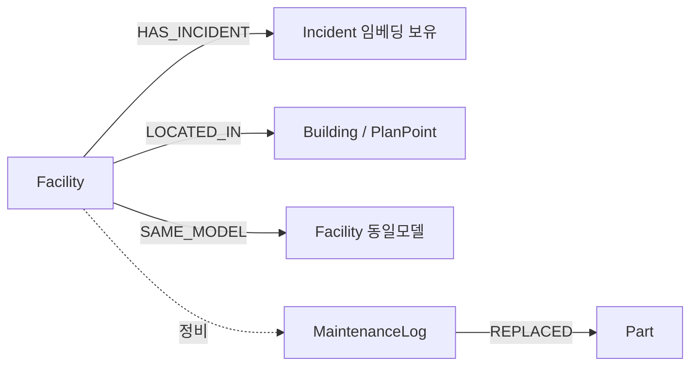

# 11. 데이터 아키텍처

> 데이터가 **어디에 저장되고 어떻게 흐르는지** 리뷰용 한 장. 아키텍처: [01-architecture.md](01-architecture.md) · DB 설계(테이블·ERD): [03-database-design.md](03-database-design.md)
> 원칙: PostgreSQL이 **SoR**(단일 사실 원천), Neo4j는 시설 도메인 **파생 그래프**(재생성 가능). 임베딩은 문서=pgvector·시설=Neo4j **한 곳만**.

## 1. 스토어 맵

| 스토어 | 담는 것 | 안 담는 것 | 격리 |
|--------|---------|-----------|------|
| **PostgreSQL 16 + pgvector** (SoR) | 업무 전 도메인(계정·세대·문서메타·대화·민원·공지·**인앱 알림함**(`notifications`)·시설·회의록(문서)·관리비·평면도·감사·큐) + **문서 임베딩**(`document_chunks`) | 시설 텍스트 임베딩(→Neo4j), 원본 파일 바이트(→S3) | **RLS** 행 격리(`tenant_id`) |
| **Neo4j** (파생) | 시설 도메인 그래프(설비·장애·정비·부품·위치) + **시설 텍스트 벡터**(노드 프로퍼티) | 업무 원천(항상 PG가 SoR), 문서 임베딩 | `tenant_id` 노드 프로퍼티 + **쿼리 레이어 강제 필터** |
| **Redis** | 응답 캐시(정확/의미)·세션·arq 큐 | 영속 원천 데이터 | 키 프리픽스 `tenant:{id}:` |
| **S3 호환** | 원본 파일(문서)·평면도 이미지·업로드 엑셀 | 정형/관계 데이터·임베딩 | 키 프리픽스 `{tenant_id}/`, 서명 URL |

## 2. 데이터 배치 결정표

| 데이터 | 저장 위치 | 임베딩 | 근거 |
|--------|-----------|--------|------|
| 공지·규약·지침 | PG `documents`+`document_chunks`, 원본 S3 | pgvector | RAG 검색 대상 |
| 회의록(문서) | PG `documents`+`document_chunks`, 원본 S3 | pgvector | 일반 문서와 동일 파이프라인(STT·자동요약은 추후) |
| 민원 | PG `inquiries` | pgvector(본문, 선택) | 유사 민원 검색 |
| 첨부(추출 텍스트) | PG `document_chunks`, 원본 S3 | pgvector | 문서와 동일 파이프라인 |
| 시설 이력(설비·장애·조치·부품) | PG(SoR) → Neo4j(파생) | **Neo4j 노드 벡터만** | 그래프 확장 + 증상 유사도 |
| 관리비 | PG `fees` | **없음(정형, SQL 조회)** | AI는 설명만, 계산·검색 불필요 |
| 평면도 좌표·설비 상태 | PG `plan_devices`·`facilities` | **없음(정형, SQL 조회)** | 좌표·상태는 정형 질의 |
| 명부·계정 | PG `users`·`pii_vault` | **없음** | 정형·PII 분리 저장 |

## 3. 데이터 흐름

### 3.1 문서 인제스트

업로드 원본은 S3, 정규화 텍스트·임베딩은 pgvector. `content_hash`로 멱등, 버전 변경 시 증분 재색인. **발송된 공지도 인제스트 트리거** — `documents`(`source_type=공지`)로 자동 색인, 정정·철회 시 재색인/제거.



### 3.2 질의 라우팅

캐시 미스면 의도분류(AI 처리/사람연결)를 거쳐 **읽기 전용 도구호출 에이전트**가 필요한 소스(pgvector·Neo4j·SQL)를 선택·조합한다. 도구는 전부 읽기 전용, 스텝 상한 2~3회(초과 시 현재 근거로 답변/폴백), 도구 결과도 출처 카드로 표기. 정형 조회(관리비 등)는 SQL 도구가 답하고 AI는 설명만, 근거 부족·불확실은 담당자 연결 폴백. 파이프라인 전문·도구 표는 [01 §5.2](01-architecture.md).



### 3.3 관리비 엑셀 업로드

관리자 엑셀이 원천(AI는 설명만). 검증 후 확정하면 해당 월 `fees`를 전체 교체. 상세 스키마: [03 §4.6](03-database-design.md).



### 3.4 온보딩·명부

소장 명부 엑셀이 `users`를 사전 생성. 입주민 가입은 이메일+비밀번호 → **이메일 검증**([ADR-0014](adr/0014-local-email-auth.md)) → **개인정보 동의**(`policy_version` 기록) → 정보 입력(**만 14세 미만 차단**) → 사전등록 행과 자동 대조, 소장 최종 승인으로 `active`(자동 승격 없음). 명부 재업로드는 **diff 병합**(`pre_registered`만 교체, 매칭된 `pending`/`active` 불변, 빠진 세대는 '전출 후보'로 표시). 스키마: [03 §4.1](03-database-design.md).



### 3.5 PG→Neo4j 동기화

시설 쓰기는 도메인 행과 `outbox_events`를 **한 트랜잭션**에 기록(이중 쓰기 금지). `ai-worker`가 순차 폴링해 Neo4j MERGE, 실패는 재시도. 전체 리플레이로 그래프 재구성 가능. 순서(`sequence`)·중복 차단(`dedupe_key`)·`FOR UPDATE SKIP LOCKED` claim·노드 `last_applied_version`(역전 방지)·삭제 tombstone·재시도 초과 시 DLQ는 [03 §4.9](03-database-design.md).



## 4. Neo4j 그래프 모델

시설 도메인만 투영한다. 모든 노드는 PG 참조키 `pg_id`와 격리키 `tenant_id`를 보유하고, **모든 Cypher는 `tenant_id` 필터를 강제**한다(쿼리 레이어에서 주입).

**격리 강제**:
- **raw Cypher 금지** — tenant predicate를 구조적으로 포함하는 **typed query 레이어만** 통해 접근한다(코드 리뷰가 아니라 구조로 차단). 임의 Cypher 실행 경로를 열지 않는다.
- **관계 생성 시 양 끝 노드의 `tenant_id` 일치 검증** — MERGE 전 양 끝 tenant를 대조해 cross-tenant 관계를 만들 수 없게 한다.
- **Neo4j stale·장애 시 시설 그래프 결과를 제외하고 PG로 폴백**(시설 정형 조회는 PG SQL 도구가 담당) — 그래프 미가용이 전체 응답 실패로 번지지 않게 한다.



| 요소 | 정의 |
|------|------|
| **노드** | `Facility`{pg_id, tenant_id, name, type, status} · `Incident`{pg_id, tenant_id, symptom, resolution, **embedding**} · `MaintenanceLog`{pg_id, tenant_id, work, performed_at} · `Part`{pg_id, tenant_id, name, model} · `Building`/`PlanPoint`{pg_id, tenant_id, 위치} |
| **관계** | `HAS_INCIDENT`(설비→장애) · `SAME_MODEL`(동일 모델 설비 간, 유사 장애 회수) · `REPLACED`(정비→교체 부품) · `LOCATED_IN`(설비→동·배치도 포인트) |

시설 텍스트 벡터 인덱스(임베딩 모델·차원은 pgvector와 **동일** — bge-m3, 1024, cosine):

```cypher
CREATE VECTOR INDEX incident_embedding IF NOT EXISTS
FOR (i:Incident) ON (i.embedding)
OPTIONS { indexConfig: {
  `vector.dimensions`: 1024,                  -- pgvector document_chunks와 동일 모델·차원
  `vector.similarity_function`: 'cosine'
}};

-- 검색은 항상 tenant 필터 후 벡터 매칭
MATCH (i:Incident {tenant_id: $tenant})
CALL db.index.vector.queryNodes('incident_embedding', $k, $queryVector)
YIELD node, score
WHERE node.tenant_id = $tenant
RETURN node, score;
```

> **전역 top-K 후 필터의 한계**: `db.index.vector.queryNodes`는 인덱스 **전역**에서 top-K를 뽑은 뒤 `WHERE`로 tenant를 거른다 → 다른 tenant 노드가 후보 슬롯을 점유하면 자기 tenant 결과의 **recall이 떨어진다**. 대응: `$k`를 여유 있게 잡아 필터 후 재절단하고, **tenant별 recall을 측정**한다. Neo4j 버전이 pre-filter(메타데이터 선필터)를 지원하면 도입을 검토한다(파일럿 spike로 검증).

## 5. 정합성 원칙

- **중복 임베딩 금지**: 문서=pgvector, 시설 텍스트=Neo4j — 같은 텍스트를 두 스토어에 임베딩하지 않는다.
- **PG는 SoR, Neo4j는 파생**: Neo4j는 `outbox_events` 전체 리플레이로 언제든 재생성. 불일치 시 PG 기준 재구성.
- **이중 쓰기 금지**: 앱이 PG와 Neo4j에 동시 직접 쓰기 하지 않는다. 쓰기는 `PG 트랜잭션 + outbox` 한 경로, 반영은 `ai-worker` 단독.
- **임베딩 모델·차원 통일**: pgvector와 Neo4j 벡터 인덱스는 동일 모델·차원 — **bge-m3(1024, cosine)**, Ollama/vLLM 로컬 실행. 모델 변경은 전 스토어 동시 재색인 이벤트([03 §8](03-database-design.md)).
- **tenant 격리 전 스토어**: PG=RLS · Neo4j=노드 `tenant_id`+Cypher 강제 필터 · Redis=키 프리픽스 · S3=키 프리픽스.
